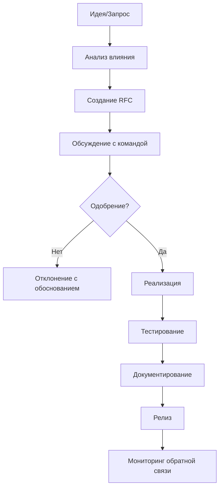

# Поддержка-дизайн-системы

## Обзор

Поддержка дизайн-системы — это комплекс мероприятий, направленных на обеспечение актуальности, стабильности и соответствия системы потребностям пользователей. Эффективная поддержка включает в себя управление изменениями, версионирование, тестирование, мониторинг использования и взаимодействие с командами-пользователями.

Этот документ охватывает стратегии и практики поддержки дизайн-системы, процессы управления изменениями и взаимодействия с сообществом пользователей.

## Стратегии поддержки дизайн-системы

### 1. Управление изменениями

Эффективное управление изменениями обеспечивает стабильность и предсказуемость для пользователей дизайн-системы.

#### Процесс внесения изменений



#### RFC (Request for Comments)

Для значительных изменений необходимо создавать RFC:

```markdown
# RFC 001: Добавление темной темы

## Статус
Принято

## Автор
Иван Иванов

## Резюме
Добавить поддержку темной темы для всех компонентов дизайн-системы.

## Мотивация
Темная тема улучшает доступность и снижает утомляемость глаз при работе в условиях низкой освещенности.

## Общее описание
Создать систему темизации на основе CSS-переменных и дизайн-токенов.

## Технические детали
- Расширить [[Токены-дизайна]] для поддержки тем
- Обновить компоненты для работы с темами
- Добавить ThemeProvider

## Потенциальные проблемы
- Увеличение размера бандла
- Необходимость тестирования всех компонентов

## Альтернативы
- Использование стороннего решения (например, styled-components ThemeProvider)
```

### 2. Версионирование

Используйте семантическое версионирование (SemVer) для управления изменениями:

- **MAJOR** - изменения, нарушающие обратную совместимость
- **MINOR** - добавление новых функций с сохранением совместимости
- **PATCH** - исправление ошибок

#### Стратегия версионирования

```json
{
  "versioning": {
    "strategy": "semver",
    "compatibility": {
      "major": "breaking_changes",
      "minor": "new_features",
      "patch": "bug_fixes"
    },
    "migration": {
      "guide_required": true,
      "automated_tooling": true
    }
  }
}
```

### 3. Тестирование и качество

#### Типы тестов

1. **Unit-тесты** - проверка отдельных компонентов
2. **Визуальные тесты** - контроль визуального соответствия
3. **Интеграционные тесты** - проверка взаимодействия компонентов
4. **Доступность** - проверка соответствия WCAG

```javascript
// __tests__/Button.visual.test.js
import { check } from 'argos';

describe('Button Visual Tests', () => {
  beforeAll(async () => {
    await page.goto('http://localhost:6006/iframe.html?id=button--primary');
  });

  it('should match primary button snapshot', async () => {
    await check(page, 'Button Primary');
  });

  it('should match secondary button snapshot', async () => {
    await page.goto('http://localhost:6006/iframe.html?id=button--secondary');
    await check(page, 'Button Secondary');
  });
});
```

```javascript
// __tests__/accessibility.test.js
import { axe, toHaveNoViolations } from 'jest-axe';

expect.extend(toHaveNoViolations);

describe('Button Accessibility Tests', () => {
  it('should have no accessibility violations', async () => {
    const { container } = render(<Button>Click me</Button>);
    const results = await axe(container);
    expect(results).toHaveNoViolations();
  });
});
```

#### Линтеры и форматирование

```javascript
// .eslintrc.js
module.exports = {
  extends: [
    '@design-system/eslint-config',
    'plugin:react/recommended',
    'plugin:jsx-a11y/recommended'
  ],
  rules: {
    'design-system/no-hardcoded-colors': 'error',
    'design-system/use-design-tokens': 'error',
    'react/prop-types': 'off',
    'react/react-in-jsx-scope': 'off'
  }
};
```

## Процессы поддержки

### 1. Отслеживание и обработка запросов

#### Система тикетов

Используйте систему тикетов (например, GitHub Issues) для отслеживания запросов:

```markdown
## Шаблон запроса на улучшение

**Описание проблемы**
Четкое описание проблемы или потребности

**Решение**
Предлагаемое решение или подход

**Альтернативы**
Рассмотренные альтернативные решения

**Дополнительный контекст**
Любая дополнительная информация
```

#### Приоритезация задач

```javascript
// Приоритеты задач
const priorityMatrix = {
  critical: {
    label: 'critical',
    color: '#e11d21',
    description: 'Критические баги, ломающие функциональность'
  },
  high: {
    label: 'high',
    color: '#ea4a5a',
    description: 'Важные улучшения и новые функции'
  },
  medium: {
    label: 'medium',
    color: '#fbca04',
    description: 'Умеренные улучшения и изменения'
  },
  low: {
    label: 'low',
    color: '#159818',
    description: 'Мелкие улучшения и задачи'
  }
};
```

### 2. Мониторинг использования

#### Аналитика использования

Отслеживайте, как используются компоненты:

```javascript
// analytics.js
class DesignSystemAnalytics {
  trackComponentUsage(componentName, props, context) {
    this.sendEvent('component_usage', {
      componentName,
      props: Object.keys(props),
      context,
      timestamp: Date.now(),
      version: this.systemVersion
    });
  }

  trackMigration(componentName, oldVersion, newVersion) {
    this.sendEvent('migration', {
      componentName,
      oldVersion,
      newVersion,
      timestamp: Date.now()
    });
  }
}
```

#### Панель мониторинга

Создайте панель для отслеживания использования:

```jsx
// Dashboard.jsx
import React, { useState, useEffect } from 'react';

const Dashboard = () => {
  const [stats, setStats] = useState({});
  
  useEffect(() => {
    fetch('/api/design-system-stats')
      .then(res => res.json())
      .then(setStats);
  }, []);

  return (
    <div className="dashboard">
      <h1>Статистика дизайн-системы</h1>
      
      <div className="stats-grid">
        <StatCard 
          title="Активные проекты" 
          value={stats.activeProjects} 
        />
        <StatCard 
          title="Компоненты использованы" 
          value={stats.componentsUsed} 
        />
        <StatCard 
          title="Скачивания" 
          value={stats.downloads} 
        />
      </div>
      
      <UsageChart data={stats.usageTrends} />
      <MigrationTracker data={stats.migrationStatus} />
    </div>
  );
};
```

### 3. Обратная связь и взаимодействие

#### Система обратной связи

Реализуйте механизмы получения обратной связи:

```jsx
// FeedbackWidget.jsx
import React, { useState } from 'react';

const FeedbackWidget = () => {
  const [showForm, setShowForm] = useState(false);
  const [feedback, setFeedback] = useState({
    type: 'bug',
    message: '',
    severity: 'medium'
  });

  const handleSubmit = (e) => {
    e.preventDefault();
    // Отправка обратной связи
    console.log('Feedback submitted:', feedback);
    setShowForm(false);
  };

  if (!showForm) {
    return (
      <button className="feedback-trigger" onClick={() => setShowForm(true)}>
        Обратная связь
      </button>
    );
  }

  return (
    <div className="feedback-widget">
      <form onSubmit={handleSubmit}>
        <select 
          value={feedback.type} 
          onChange={e => setFeedback({...feedback, type: e.target.value})}
        >
          <option value="bug">Баг</option>
          <option value="feature">Новая функция</option>
          <option value="improvement">Улучшение</option>
        </select>
        
        <textarea
          value={feedback.message}
          onChange={e => setFeedback({...feedback, message: e.target.value})}
          placeholder="Опишите вашу обратную связь..."
        />
        
        <button type="submit">Отправить</button>
        <button type="button" onClick={() => setShowForm(false)}>Отмена</button>
      </form>
    </div>
  );
};
```

#### Сообщество пользователей

Создайте платформу для общения пользователей:

- Slack/Teams канал
- Форум поддержки
- Ежемесячные встречи
- Демо-дни

## Автоматизация поддержки

### 1. CI/CD для дизайн-системы

#### Pipeline для проверки изменений

```yaml
# .github/workflows/design-system.yml
name: Design System CI

on:
  push:
    branches: [main, beta]
  pull_request:
    branches: [main]

jobs:
  test:
    runs-on: ubuntu-latest
    steps:
      - uses: actions/checkout@v3
      - name: Setup Node.js
        uses: actions/setup-node@v3
        with:
          node-version: '18'
          cache: 'npm'
      
      - name: Install dependencies
        run: npm ci
      
      - name: Run unit tests
        run: npm run test:unit
      
      - name: Run visual tests
        run: npm run test:visual
      
      - name: Run accessibility tests
        run: npm run test:a11y
      
      - name: Run linting
        run: npm run lint
      
      - name: Build components
        run: npm run build
      
      - name: Check token consistency
        run: npm run validate:tokens

  release:
    needs: test
    runs-on: ubuntu-latest
    if: github.ref == 'refs/heads/main'
    steps:
      - uses: actions/checkout@v3
      - name: Setup Node.js
        uses: actions/setup-node@v3
        with:
          node-version: '18'
          registry-url: 'https://registry.npmjs.org'
      
      - name: Install dependencies
        run: npm ci
      
      - name: Build
        run: npm run build
      
      - name: Release
        run: npx semantic-release
        env:
          NODE_AUTH_TOKEN: ${{ secrets.NPM_TOKEN }}
          GITHUB_TOKEN: ${{ secrets.GITHUB_TOKEN }}
```

### 2. Автоматическое обновление зависимостей

```javascript
// .github/dependabot.yml
version: 2
updates:
  - package-ecosystem: "npm"
    directory: "/"
    schedule:
      interval: "weekly"
    open-pull-requests-limit: 10
    labels:
      - "dependencies"
      - "automated"
    commit-message:
      prefix: "deps"
      include: "scope"
```

### 3. Генерация документации

```javascript
// scripts/generate-docs.js
const fs = require('fs');
const path = require('path');
const { execSync } = require('child_process');

// Генерация документации из JSDoc
execSync('npx jsdoc2md src/components/**/*.js > docs/api.md');

// Генерация таблицы компонентов
const componentsDir = path.join(__dirname, '../src/components');
const componentNames = fs.readdirSync(componentsDir)
  .filter(item => fs.statSync(path.join(componentsDir, item)).isDirectory());

const componentsTable = componentNames.map(name => `| ${name} | [Документация](./components/${name}.md) |`).join('\n');

const readmePath = path.join(__dirname, '../docs/README.md');
let readme = fs.readFileSync(readmePath, 'utf8');
readme = readme.replace(
  /<!-- components-table -->[\s\S]*<!-- \/components-table -->/,
  `<!-- components-table -->\n${componentsTable}\n<!-- /components-table -->`
);

fs.writeFileSync(readmePath, readme);
```

## Управление качеством

### 1. Код-ревью

#### Шаблон код-ревью

```
## Проверка изменений

- [ ] Соответствие принципам дизайн-системы
- [ ] Использование дизайн-токенов
- [ ] Доступность (a11y)
- [ ] Тесты (unit, visual, a11y)
- [ ] Документация
- [ ] Производительность
- [ ] Обратная совместимость
```

### 2. Стандарты кода

#### ESLint конфигурация

```javascript
// .eslintrc.design-system.js
module.exports = {
  extends: ['@design-system'],
  rules: {
    // Запрет на использование жестко закодированных значений
    'design-system/no-hardcoded-values': 'error',
    
    // Обязательное использование дизайн-токенов
    'design-system/use-tokens': 'error',
    
    // Проверка доступности
    'design-system/a11y-check': 'error',
    
    // Проверка производительности
    'design-system/performance-check': 'warn'
  }
};
```

### 3. Проверка производительности

```javascript
// performance.test.js
import { render, performance } from '@testing-library/react';

describe('Component Performance', () => {
  test('Button should render in under 16ms', async () => {
    const startTime = performance.now();
    render(<Button>Test</Button>);
    const endTime = performance.now();
    
    expect(endTime - startTime).toBeLessThan(16); // 60 FPS
  });
  
  test('Complex component tree should not cause performance issues', () => {
    const startTime = performance.now();
    render(
      <div>
        {Array.from({ length: 100 }, (_, i) => (
          <Card key={i}>
            <Button>Button {i}</Button>
          </Card>
        ))}
      </div>
    );
    const endTime = performance.now();
    
    expect(endTime - startTime).toBeLessThan(100);
  });
});
```

## Развитие дизайн-системы

### 1. Планирование дорожной карты

#### Дорожная карта развития

```markdown
# Дорожная карта дизайн-системы (2024)

## Q1 2024
- [x] Темная тема
- [x] Новые компоненты: Accordion, Tabs
- [ ] Улучшенная документация

## Q2 2024
- [ ] Адаптивные компоненты
- [ ] Поддержка i18n
- [ ] Новые темы (корпоративная, креативная)

## Q3 2024
- [ ] Интеграция с Figma
- [ ] Новые атомарные компоненты
- [ ] Улучшенные визуальные тесты

## Q4 2024
- [ ] Миграция на новую архитектуру
- [ ] Поддержка Web Components
- [ ] Расширенные возможности темизации
```

### 2. Эксперименты и инкубация

#### Процесс инкубации

Для новых идей создавайте экспериментальные компоненты:

```jsx
// experimental/Incubator.jsx
import React from 'react';

// Экспериментальный компонент для тестирования новой концепции
export const ExperimentalComponent = ({ variant, ...props }) => {
  // Реализация новой идеи
  return (
    <div className={`experimental-component experimental-component--${variant}`}>
      {/* Содержимое компонента */}
    </div>
  );
};

// Мета-информация для отслеживания экспериментов
ExperimentalComponent.__EXPERIMENTAL__ = true;
ExperimentalComponent.__EXPERIMENT_END_DATE__ = '2024-06-30';
```

### 3. Обратная миграция

#### Инструменты для миграции

Создайте автоматические инструменты для миграции:

```javascript
// scripts/migrate-v2-to-v3.js
const jscodeshift = require('jscodeshift');

function transform(file, api) {
  const j = api.jscodeshift;
  const root = j(file.source);

  // Замена старых имен пропсов
  root.find(j.JSXAttribute, {
    name: { type: 'JSXIdentifier', name: 'primary' }
  })
  .forEach(path => {
    path.node.name.name = 'variant';
    path.node.value = j.literal('primary');
  });

  return root.toSource();
}

module.exports = transform;
module.exports.parser = 'tsx';
```

## Коммуникация и прозрачность

### 1. Обновления и объявления

#### Рассылка обновлений

```markdown
# Обновление дизайн-системы v3.2.0

## Новые компоненты
- Modal (модальное окно)
- Tooltip (всплывающая подсказка)
- Badge (бейдж)

## Улучшения
- Улучшена доступность всех компонентов
- Добавлена поддержка RTL (справа налево)
- Оптимизированы размеры бандла

## Изменения
- Кнопка больше не принимает пропс `primary`, используйте `variant="primary"`
- Удалена устаревшая тема `legacy`

## Миграция
[Руководство по миграции](/docs/migration-guide-v3.2.0)
```

### 2. Статус системы

#### Страница статуса

Создайте страницу со статусом системы:

```jsx
// StatusPage.jsx
import React, { useState, useEffect } from 'react';

const StatusPage = () => {
  const [status, setStatus] = useState({
    components: 'operational',
    documentation: 'operational',
    npm: 'operational',
    figma: 'degraded'
  });

  return (
    <div className="status-page">
      <h1>Статус дизайн-системы</h1>
      
      <StatusCard 
        name="Компоненты" 
        status={status.components}
        description="Доступность компонентов в npm"
      />
      
      <StatusCard 
        name="Документация" 
        status={status.documentation}
        description="Доступность документации"
      />
      
      <StatusCard 
        name="Figma библиотека" 
        status={status.figma}
        description="Доступность Figma библиотеки"
      />
    </div>
  );
};
```

## Заключение

Поддержка дизайн-системы — это непрерывный процесс, требующий системного подхода, автоматизации и постоянного взаимодействия с сообществом пользователей. Эффективная поддержка обеспечивает стабильность, развитие и актуальность дизайн-системы, что в свою очередь способствует более высокому качеству пользовательских интерфейсов и более эффективной работе команд.

Для успешной поддержки необходимо:

1. Установить четкие процессы управления изменениями
2. Автоматизировать тестирование и выпуск обновлений
3. Обеспечить прозрачность и коммуникацию с пользователями
4. Постоянно улучшать качество и функциональность системы
5. Следить за трендами и потребностями пользователей

Для более глубокого понимания архитектуры дизайн-системы рекомендуется ознакомиться с [[Создание-дизайн-системы]], [[Компоненты-дизайна]] и [[Документация-дизайн-системы]].