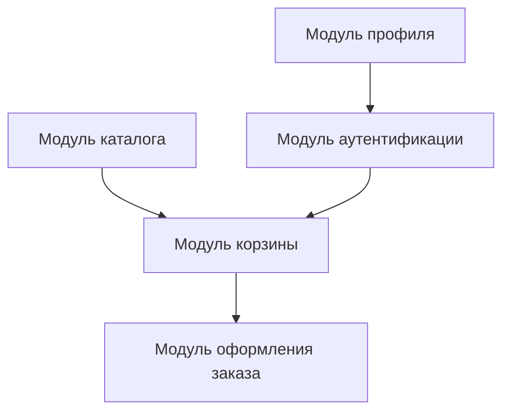

# Применение Domain-Driven Design в архитектуре фронтенда

Domain-Driven Design (DDD) - это подход к проектированию программного обеспечения, который фокусируется на сложной предметной области и создании модели, которая тесно связана с бизнес-логикой. Хотя DDD изначально был разработан для backend-разработки, его принципы могут быть успешно применены и в архитектуре фронтенда.

## Введение в DDD в контексте фронтенда

Традиционно DDD ассоциируется с backend-разработкой, где сложные бизнес-процессы требуют четкого моделирования домена. Однако современные фронтенд-приложения становятся все более сложными, и применение принципов DDD позволяет лучше структурировать код и управлять этой сложностью.

> [!note] Важно
> Применение DDD в фронтенде не означает дословного переноса backend-шаблонов. Вместо этого, мы адаптируем концепции DDD к специфике клиентских приложений.

## Основные концепции DDD в фронтенде

### Домен и сущности

В контексте фронтенда **домен** представляет собой бизнес-область, которую отражает пользовательский интерфейс. Это может быть область управления заказами, система управления контентом или любая другая бизнес-область.

**Сущности** в фронтенде - это объекты, которые имеют уникальный идентификатор и жизненный цикл. Примеры:

- Пользователь в системе
- Заказ в интернет-магазине
- Документ в системе управления контентом

```javascript
// Пример сущности в фронтенде
class User {
  constructor(id, email, name) {
    this.id = id;
    this.email = email;
    this.name = name;
  }

  updateEmail(newEmail) {
    if (!newEmail.includes('@')) {
      throw new Error('Invalid email format');
    }
    this.email = newEmail;
  }
}
```

### Значения (Value Objects)

**Значения** - это объекты, которые определяются по их атрибутам, а не по идентификатору. Они неизменяемы и сравниваются по содержимому.

```javascript
// Пример Value Object
class Money {
  constructor(amount, currency) {
    this.amount = amount;
    this.currency = currency;
  }

  add(money) {
    if (this.currency !== money.currency) {
      throw new Error('Cannot add different currencies');
    }
    return new Money(this.amount + money.amount, this.currency);
  }

  equals(other) {
    return this.amount === other.amount && this.currency === other.currency;
  }
}
```

### Агрегаты

**Агрегаты** - это кластеры сущностей и значений, которые рассматриваются как единое целое. В фронтенде агрегаты помогают определить границы изменений и управлять согласованностью данных.

```javascript
// Пример агрегата заказа
class Order {
  constructor(orderId, customer) {
    this.orderId = orderId;
    this.customer = customer;
    this.items = [];
    this.status = 'pending';
  }

  addItem(product, quantity) {
    const existingItem = this.items.find(item => item.product.id === product.id);
    
    if (existingItem) {
      existingItem.quantity += quantity;
    } else {
      this.items.push({ product, quantity });
    }
  }

  removeItem(productId) {
    this.items = this.items.filter(item => item.product.id !== productId);
  }

  calculateTotal() {
    return this.items.reduce((total, item) => {
      return total + (item.product.price * item.quantity);
    }, 0);
  }
}
```

## Бounded Contexts в фронтенде

**Bounded Context** - это границы, в которых определенная модель имеет смысл. В фронтенде это может быть:

- Модуль администрирования
- Модуль пользовательского профиля
- Модуль корзины покупок
- Модуль каталога товаров

Каждый Bounded Context в фронтенде может иметь:

- Собственную модель данных
- Собственные компоненты
- Собственную логику обработки событий

```javascript
// Пример Bounded Context для модуля корзины покупок
const ShoppingCartContext = {
  state: {
    items: [],
    total: 0,
    discount: 0
  },
  
  actions: {
    addToCart(product, quantity) {
      // Логика добавления в корзину
    },
    
    removeFromCart(productId) {
      // Логика удаления из корзины
    },
    
    applyDiscount(code) {
      // Логика применения скидки
    }
  }
};
```

## Стратегический дизайн в фронтенде

### Контекстные карты

Контекстные карты в фронтенде показывают, как различные модули взаимодействуют друг с другом. Это особенно важно в сложных SPA-приложениях.



### Взаимодействие между контекстами

В фронтенде взаимодействие между контекстами может происходить через:

- События (Events)
- Общие сервисы
- Глобальное состояние
- Параметры маршрутов

## Тактические шаблоны DDD в фронтенде

### Сервисы домена

**Сервисы домена** содержат бизнес-логику, которая не принадлежит конкретной сущности или значению.

```javascript
// Пример сервиса домена
class OrderService {
  static calculateShippingCost(order, destination) {
    // Сложная логика расчета стоимости доставки
    const distance = this.calculateDistance(order.origin, destination);
    return distance * 0.5 + order.weight * 2;
  }

  static validateOrder(order) {
    const errors = [];
    
    if (order.items.length === 0) {
      errors.push('Order must have at least one item');
    }
    
    if (order.customer === null) {
      errors.push('Customer information is required');
    }
    
    return errors;
  }
}
```

### Репозитории

**Репозитории** в фронтенде обеспечивают абстракцию доступа к данным. В контексте фронтенда это может быть:

- API-сервисы
- Локальное хранилище
- Кэш данных

```javascript
// Пример репозитория в фронтенде
class UserRepository {
  async findById(id) {
    const response = await fetch(`/api/users/${id}`);
    const userData = await response.json();
    return new User(userData.id, userData.email, userData.name);
  }

  async save(user) {
    const response = await fetch(`/api/users/${user.id}`, {
      method: 'PUT',
      headers: { 'Content-Type': 'application/json' },
      body: JSON.stringify({
        email: user.email,
        name: user.name
      })
    });
    
    if (!response.ok) {
      throw new Error('Failed to save user');
    }
  }
}
```

### Фабрики

**Фабрики** используются для создания сложных объектов, особенно когда процесс создания требует бизнес-логики.

```javascript
// Пример фабрики
class OrderFactory {
  static createOrder(customer, items) {
    const order = new Order(this.generateOrderId(), customer);
    
    items.forEach(item => {
      order.addItem(item.product, item.quantity);
    });
    
    // Применить бизнес-логику при создании заказа
    if (customer.isPremium()) {
      order.applyPremiumDiscount();
    }
    
    return order;
  }

  static generateOrderId() {
    return `ORD-${Date.now()}-${Math.random().toString(36).substr(2, 9)}`;
  }
}
```

## Архитектурные шаблоны для фронтенда с DDD

### Чистая архитектура

Чистая архитектура (Clean Architecture) может быть адаптирована для фронтенда, используя принципы DDD:

- Внутреннее ядро содержит доменные сущности и бизнес-логику
- Средний уровень содержит интерфейсы и сервисы
- Внешний уровень содержит UI-компоненты и инфраструктуру

```
┌─────────────────┐
│   Framework   │  UI, API Clients
├─────────────────┤
│   Interface   │  Adapters, Gateways
├─────────────────┤
│   Application │  Use Cases
├─────────────────┤
│    Domain     │  Entities, Services
└─────────────────┘
```

### Слоистая архитектура

В фронтенде можно выделить следующие слои:

1. **UI-слой** - компоненты и представления
2. **Слой приложения** - координирует работу между слоями
3. **Доменный слой** - сущности, сервисы и бизнес-логика
4. **Инфраструктурный слой** - сетевые вызовы, локальное хранилище

## Практические рекомендации по внедрению DDD в фронтенд

### 1. Начните с моделирования домена

Перед началом разработки важно понять бизнес-домен и создать его модель. Это можно сделать через:

- Дискуссии с бизнес-аналитиками
- Создание доменных историй
- Определение ключевых сущностей и их взаимосвязей

### 2. Используйте Ubiquitous Language

Создайте общий язык, используемый как разработчиками, так и бизнесом. Это особенно важно в фронтенде, где термины могут отличаться от backend-терминов.

### 3. Разделяйте ответственность

Разделяйте код по доменным областям, а не по техническим слоям. Это улучшает модульность и тестируемость.

### 4. Используйте события для коммуникации

Используйте систему событий для коммуникации между различными частями приложения, особенно между разными Bounded Contexts.

## Преимущества применения DDD в фронтенде

1. **Лучшее понимание домена** - разработчики лучше понимают бизнес-процессы
2. **Модульность** - код становится более структурированным и легче поддается тестированию
3. **Поддерживаемость** - изменения в одной области не влияют на другие
4. **Масштабируемость** - новые функции легче интегрировать в существующую архитектуру

## Возможные трудности

1. **Сложность реализации** - DDD требует дополнительных усилий на начальном этапе
2. **Переобучение команды** - нужно время на освоение новых концепций
3. **Переосмысление архитектуры** - может потребоваться изменение существующей архитектуры

## Заключение

Применение Domain-Driven Design в архитектуре фронтенда позволяет создавать более структурированные и поддерживаемые приложения. Хотя DDD изначально был разработан для backend-систем, его принципы успешно адаптируются для клиентских приложений.

Ключ к успешному внедрению - это понимание того, что DDD в фронтенде требует адаптации традиционных подходов к специфике клиентских приложений. Важно сохранить фокус на домене и использовать Ubiquitous Language для обеспечения согласованности между командами.

## См. также

- [[Архитектура чистого кода]]
- [[Модель-вид-контроллер]]
- [[Функциональное программирование]]
- [[Тестирование веб-приложений]]
- [[Состояние приложения]]
- [[Архитектура компонентов]]
- [[Шаблоны проектирования]]
- [[Типизированные языки программирования]]
- [[Состояние и поток данных]]
- [[Микрофронтенды]]
- [[Реактивное программирование]]
- [[Событийно-ориентированная архитектура]]
- [[Функциональные и классовые компоненты]]
- [[Управление зависимостями]]
- [[Сборка и оптимизация]]

## Дополнительные ресурсы

- [DDD на практике](https://martinfowler.com/tags/domain%20driven%20design.html) - статьи Мартина Фаулера
- [DDD Reference](https://domainlanguage.com/ddd/) - ресурсы от создателей DDD
- [Frontend Architecture for Scalable Applications](https://addyosmani.com/blog/front-end-architecture/) - архитектурные подходы в фронтенде