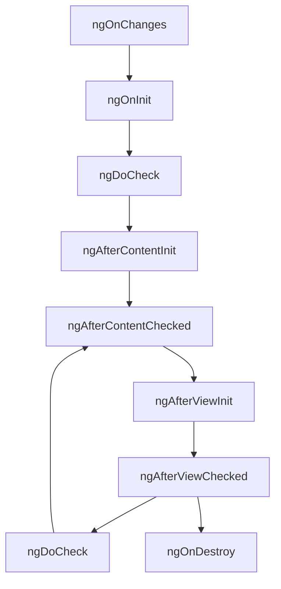

# Методы жизненного цикла в Angular

Angular предоставляет богатый набор хуков жизненного цикла, которые позволяют разработчикам выполнять код на различных этапах существования компонента. Эти хуки реализуются через интерфейсы и предоставляют контроль над процессом создания, обновления и уничтожения компонентов.

## Основные хуки жизненного цикла

Для использования хуков жизненного цикла, компонент должен реализовать соответствующий интерфейс.

### Фаза монтирования

Эти хуки вызываются при создании компонента и его вставке в DOM:

#### ngOnChanges
```typescript
import { Component, Input, OnChanges, SimpleChanges } from '@angular/core';

@Component({
  selector: 'app-user-profile',
  template: `<div>{{ userName }}</div>`
})
export class UserProfileComponent implements OnChanges {
  @Input() userId: number;
  @Input() userName: string;

  ngOnChanges(changes: SimpleChanges) {
    console.log('ngOnChanges: Вызывается при изменении входных свойств');
    
    if (changes['userId'] && !changes['userId'].firstChange) {
      console.log('Изменился userId:', changes['userId'].currentValue);
      this.loadUserProfile(changes['userId'].currentValue);
    }
  }

  loadUserProfile(userId: number) {
    // Загрузка профиля пользователя
  }
}
```
Вызывается при изменении входных свойств (@Input). Также вызывается перед ngOnInit и при каждом последующем изменении входных свойств.

#### ngOnInit
```typescript
import { Component, OnInit } from '@angular/core';

@Component({
  selector: 'app-user-dashboard',
  template: `<div>Dashboard: {{ user.name }}</div>`
})
export class UserDashboardComponent implements OnInit {
  user: any;

  ngOnInit() {
    console.log('ngOnInit: Инициализация компонента после первого ngOnChanges');
    
    // Инициализация данных
    this.loadUserData();
    
    // Подписка на сервисы
    this.dataService.user$.subscribe(user => {
      this.user = user;
    });
  }

  loadUserData() {
    // Загрузка данных пользователя
  }
}
```
Вызывается после первого ngOnChanges. Подходит для инициализации компонента и подписки на сервисы.

#### ngAfterContentInit
```typescript
import { Component, ContentChild, AfterContentInit, ContentChildren } from '@angular/core';
import { ViewChildExampleComponent } from './view-child-example.component';

@Component({
  selector: 'app-content-example',
  template: `
    <ng-content></ng-content>
    <div *ngIf="contentChild">Content child: {{ contentChild.title }}</div>
  `
})
export class ContentExampleComponent implements AfterContentInit {
  @ContentChild('contentChild') contentChild: any;

  ngAfterContentInit() {
    console.log('ngAfterContentInit: После проекции контента');
    // Проекция контента завершена
  }
}
```
Вызывается после инициализации проекции контента (ng-content).

#### ngAfterViewInit
```typescript
import { Component, ViewChild, AfterViewInit, ElementRef } from '@angular/core';

@Component({
  selector: 'app-chart',
  template: `<canvas #chartCanvas></canvas>`
})
export class ChartComponent implements AfterViewInit {
  @ViewChild('chartCanvas', { static: true }) chartCanvas: ElementRef<HTMLCanvasElement>;

  ngAfterViewInit() {
    console.log('ngAfterViewInit: После инициализации представления');
    
    // Работа с DOM элементами
    const ctx = this.chartCanvas.nativeElement.getContext('2d');
    this.drawChart(ctx);
  }

  drawChart(ctx: CanvasRenderingContext2D) {
    // Рисование диаграммы
  }
}
```
Вызывается после инициализации представления компонента и дочерних представлений.

### Фаза обновления

Эти хуки вызываются при изменении свойств компонента:

#### ngAfterContentChecked
```typescript
import { Component, AfterContentChecked } from '@angular/core';

@Component({
  selector: 'app-check-example',
  template: `<ng-content></ng-content>`
})
export class CheckExampleComponent implements AfterContentChecked {
  ngAfterContentChecked() {
    console.log('ngAfterContentChecked: После проверки проекции контента');
    // Вызывается после ngAfterContentInit и при каждой проверке изменений
  }
}
```
Вызывается после проверки проекции контента. Вызывается после ngAfterContentInit и при каждой проверке изменений.

#### ngAfterViewChecked
```typescript
import { Component, AfterViewChecked, ViewChild, ElementRef } from '@angular/core';

@Component({
  selector: 'app-view-check',
  template: `<div #statusDiv [class.active]="isActive">Status: {{ status }}</div>`
})
export class ViewCheckComponent implements AfterViewChecked {
  @ViewChild('statusDiv') statusDiv: ElementRef;
  status = 'initial';
  isActive = false;

  ngAfterViewChecked() {
    console.log('ngAfterViewChecked: После проверки представления');
    
    // Обновление DOM после проверки изменений
    if (this.status === 'active') {
      this.isActive = true;
    }
  }
}
```
Вызывается после проверки представления компонента и дочерних представлений.

#### ngDoCheck
```typescript
import { Component, DoCheck, KeyValueDiffers, KeyValueDiffer } from '@angular/core';

@Component({
  selector: 'app-custom-check',
  template: `<div>{{ value }}</div>`
})
export class CustomCheckComponent implements DoCheck {
  value: any;
  private differ: KeyValueDiffer<any, any>;

  constructor(private differs: KeyValueDiffers) {}

  ngDoCheck() {
    console.log('ngDoCheck: Пользовательская проверка изменений');
    
    // Пользовательская логика проверки изменений
    if (!this.differ && this.value) {
      this.differ = this.differs.find(this.value).create();
    }
    
    if (this.differ) {
      const changes = this.differ.diff(this.value);
      if (changes) {
        changes.forEachChangedItem(r => console.log('Изменено:', r));
      }
    }
  }
}
```
Вызывается при каждой проверке изменений. Позволяет реализовать пользовательскую логику проверки изменений.

### Фаза размонтирования

#### ngOnDestroy
```typescript
import { Component, OnDestroy } from '@angular/core';
import { Subscription } from 'rxjs';

@Component({
  selector: 'app-data-subscriber',
  template: `<div>{{ data }}</div>`
})
export class DataSubscriberComponent implements OnDestroy {
  data: any;
  private subscription: Subscription;

  constructor(private dataService: DataService) {
    this.subscription = this.dataService.data$.subscribe(data => {
      this.data = data;
    });
  }

  ngOnDestroy() {
    console.log('ngOnDestroy: Перед уничтожением компонента');
    
    // Очистка подписок
    if (this.subscription) {
      this.subscription.unsubscribe();
    }
    
    // Очистка таймеров
    if (this.timerId) {
      clearInterval(this.timerId);
    }
    
    // Освобождение ресурсов
    this.cleanupResources();
  }

  private timerId: any;

  startTimer() {
    this.timerId = setInterval(() => {
      console.log('Таймер работает');
    }, 1000);
  }

  cleanupResources() {
    // Освобождение дополнительных ресурсов
  }
}
```
Вызывается перед уничтожением компонента. Используется для очистки ресурсов и отписки от событий.

## Диаграмма жизненного цикла Angular



## Практическое применение хуков

### Загрузка данных
```typescript
export class DataComponent implements OnInit, OnDestroy {
  data: any[];
  private subscription: Subscription;

  constructor(private dataService: DataService) {}

  ngOnInit() {
    // Загрузка данных при инициализации
    this.subscription = this.dataService.getData().subscribe(
      result => this.data = result,
      error => console.error('Ошибка загрузки данных', error)
    );
  }

  ngOnDestroy() {
    // Отписка от подписки
    if (this.subscription) {
      this.subscription.unsubscribe();
    }
  }
}
```

### Работа с DOM
```typescript
export class FocusComponent implements AfterViewInit {
  @ViewChild('inputElement') inputElement: ElementRef;

  ngAfterViewInit() {
    // Фокус на элементе после инициализации
    this.inputElement.nativeElement.focus();
  }
}
```

### Подписка на события
```typescript
export class EventComponent implements OnInit, OnDestroy {
  private resizeSubscription: Subscription;

  ngOnInit() {
    // Подписка на событие изменения размера окна
    fromEvent(window, 'resize')
      .pipe(debounceTime(100))
      .subscribe(() => this.handleResize());
  }

  ngOnDestroy() {
    // Отписка от события
    if (this.resizeSubscription) {
      this.resizeSubscription.unsubscribe();
    }
  }

  private handleResize() {
    // Обработка изменения размера
  }
}
```

## Практические рекомендации

- Используйте `ngOnInit` для инициализации компонента
- Используйте `ngOnDestroy` для очистки ресурсов
- Не выполняйте тяжелые операции в `ngDoCheck`
- Используйте `AfterViewInit` для работы с DOM-элементами
- Избегайте изменений свойств в хуках, вызывающих проверку изменений

## Связанные концепции

- [[Фазы-жизненного-цикла]]
- [[Методы-жизненного-цикла-в-React]]
- [[Методы-жизненного-цикла-в-Vue]]
- [[Практическое-применение]]
- [[Компонентная-архитектура]]
- [[Состояние-компонента]]

## Заключение

Хуки жизненного цикла в Angular предоставляют мощный механизм для управления поведением компонентов на различных этапах их существования. Понимание и правильное использование этих хуков позволяет создавать более эффективные и надежные приложения.