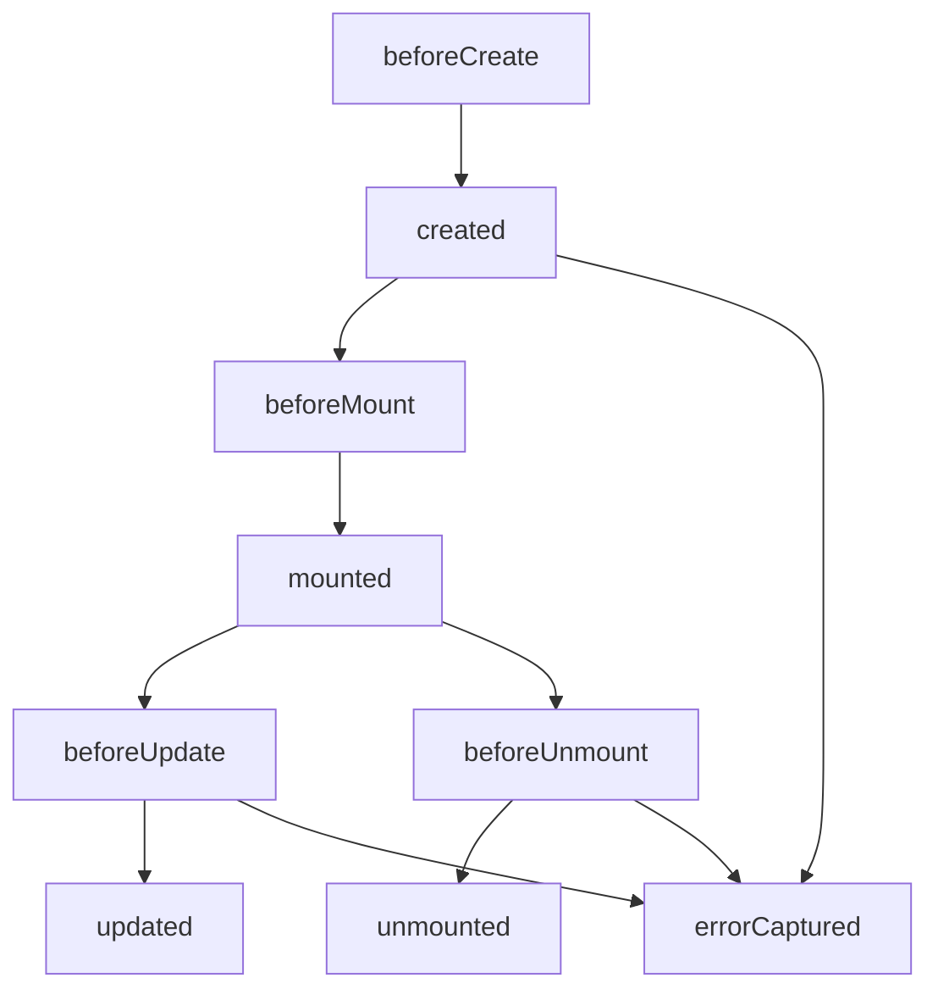

# Методы жизненного цикла в Vue

Vue.js предоставляет богатый набор хуков жизненного цикла, которые позволяют разработчикам выполнять код на различных этапах существования компонента. Эти хуки дают контроль над процессом создания, обновления и уничтожения компонентов.

## Основные хуки жизненного цикла

### Фаза монтирования

Эти хуки вызываются при создании компонента и его вставке в DOM:

#### beforeCreate
```javascript
export default {
  beforeCreate() {
    console.log('beforeCreate: Состояние еще не инициализировано');
    // this.$el недоступен
    // this.$data недоступен
  }
}
```
Вызывается сразу после инициализации экземпляра, до настройки реактивности и событий.

#### created
```javascript
export default {
  data() {
    return {
      users: []
    }
  },
  async created() {
    console.log('created: Состояние инициализировано, DOM еще не создан');
    // this.$el недоступен
    // this.$data доступен
    
    // Загрузка данных при создании
    this.users = await this.fetchUsers();
  }
}
```
Вызывается после настройки реактивности и событий, но до создания DOM. Подходит для инициализации данных.

#### beforeMount
```javascript
export default {
  beforeMount() {
    console.log('beforeMount: DOM еще не вставлен в документ');
    // this.$el существует, но еще не вставлен в DOM
  }
}
```
Вызывается перед монтированием, когда шаблон компилируется и готов к вставке в DOM.

#### mounted
```javascript
export default {
  mounted() {
    console.log('mounted: Компонент вставлен в DOM');
    // this.$el доступен
    
    // Работа с DOM-элементами
    this.$refs.canvas.focus();
    
    // Подписка на события
    this.eventListener = () => console.log('Window resize');
    window.addEventListener('resize', this.eventListener);
    
    // Запрос данных после монтирования
    this.loadAdditionalData();
  }
}
```
Вызывается после монтирования компонента. Подходит для выполнения операций, требующих доступа к DOM.

### Фаза обновления

Эти хуки вызываются при изменении реактивных данных компонента:

#### beforeUpdate
```javascript
export default {
  data() {
    return {
      count: 0
    }
  },
  beforeUpdate() {
    console.log('beforeUpdate: Данные изменены, DOM еще не обновлен');
    // this.count уже обновлен, но DOM еще не перерисован
    console.log(`Значение до обновления DOM: ${this.count}`);
  }
}
```
Вызывается перед обновлением DOM, когда реактивные данные изменяются.

#### updated
```javascript
export default {
  updated() {
    console.log('updated: DOM обновлен после изменения данных');
    // this.$el обновлен
    
    // Работа с обновленным DOM
    this.$nextTick(() => {
      // Убедиться, что DOM полностью обновлен
      this.adjustScrollPosition();
    });
  }
}
```
Вызывается после обновления DOM. Подходит для работы с обновленным DOM.

### Фаза размонтирования

#### beforeUnmount (Vue 3) / beforeDestroy (Vue 2)
```javascript
export default {
  beforeUnmount() {
    console.log('beforeUnmount: Компонент будет размонтирован');
    // Очистка подписок
    window.removeEventListener('resize', this.eventListener);
    
    // Остановка таймеров
    if (this.timer) {
      clearInterval(this.timer);
    }
  }
}
```
Вызывается перед размонтированием компонента. Используется для очистки ресурсов.

#### unmounted (Vue 3) / destroyed (Vue 2)
```javascript
export default {
  unmounted() {
    console.log('unmounted: Компонент размонтирован');
    // Последние действия перед уничтожением
    this.cleanup();
  }
}
```
Вызывается после размонтирования компонента.

### Обработка ошибок

#### errorCaptured
```javascript
export default {
  errorCaptured(err, instance, info) {
    console.error('Ошибка в дочернем компоненте:', err);
    console.error('Компонент:', instance);
    console.error('Информация:', info);
    
    // Вернуть false, чтобы остановить распространение ошибки
    return false;
  }
}
```
Вызывается при ошибке в любом дочернем компоненте.

## Диаграмма жизненного цикла Vue



## Асинхронные хуки

Все хуки жизненного цикла могут быть асинхронными:

```javascript
export default {
  async created() {
    try {
      this.data = await this.fetchData();
    } catch (error) {
      console.error('Ошибка при загрузке данных:', error);
    }
  },
  
  async mounted() {
    await this.initializeThirdPartyLib();
    this.thirdPartyLibInitialized = true;
  }
}
```

## Хуки в Composition API (Vue 3)

В Composition API хуки доступны через импорт:

```javascript
import { 
  onBeforeMount, 
  onMounted, 
  onBeforeUpdate, 
  onUpdated,
  onBeforeUnmount,
  onUnmounted,
  onErrorCaptured 
} from 'vue';

export default {
  setup() {
    onMounted(() => {
      console.log('Компонент смонтирован');
    });
    
    onUnmounted(() => {
      console.log('Компонент будет размонтирован');
    });
    
    onErrorCaptured((err, instance, info) => {
      console.error('Ошибка перехвачена:', err);
    });
    
    // Возврат реактивных данных и методов
    return {
      // ...
    };
  }
}
```

## Практические рекомендации

- Используйте `created` для инициализации данных
- Используйте `mounted` для работы с DOM
- Не забывайте очищать ресурсы в `beforeUnmount`
- Используйте `nextTick` для работы с обновленным DOM в `updated`
- Обрабатывайте ошибки с помощью `errorCaptured`

## Связанные концепции

- [[Фазы-жизненного-цикла]]
- [[Методы-жизненного-цикла-в-React]]
- [[Методы-жизненного-цикла-в-Angular]]
- [[Практическое-применение]]
- [[Компонентная-архитектура]]
- [[Состояние-компонента]]

## Заключение

Хуки жизненного цикла в Vue предоставляют мощный механизм для управления поведением компонентов на различных этапах их существования. Понимание и правильное использование этих хуков позволяет создавать более эффективные и надежные приложения.