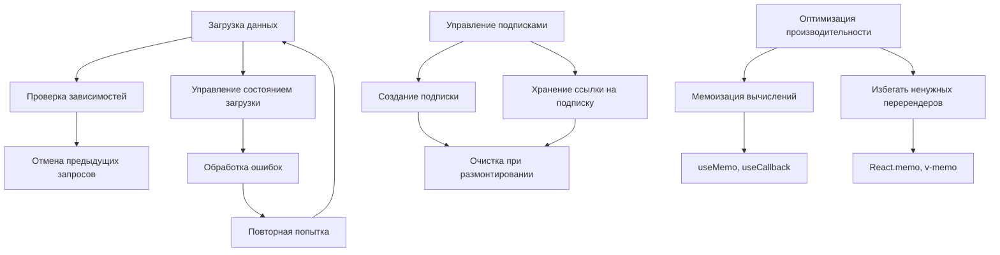

# Практическое применение жизненного цикла компонентов

Понимание жизненного цикла компонентов позволяет разработчикам эффективно управлять состоянием, производительностью и ресурсами приложений. В этой статье рассмотрим практические примеры использования методов жизненного цикла в реальных сценариях.

## Основные сценарии использования

### 1. Загрузка данных

Один из самых распространенных сценариев - загрузка данных при монтировании компонента:

#### React (классовый компонент):
```javascript
class UserProfile extends React.Component {
  constructor(props) {
    super(props);
    this.state = { user: null, loading: true, error: null };
  }

  async componentDidMount() {
    try {
      const response = await fetch(`/api/users/${this.props.userId}`);
      const user = await response.json();
      this.setState({ user, loading: false });
    } catch (error) {
      this.setState({ error, loading: false });
    }
  }

  render() {
    const { user, loading, error } = this.state;
    
    if (loading) return <div>Загрузка...</div>;
    if (error) return <div>Ошибка: {error.message}</div>;
    if (!user) return <div>Пользователь не найден</div>;
    
    return (
      <div>
        <h1>{user.name}</h1>
        <p>{user.email}</p>
      </div>
    );
  }
}
```

#### React (функциональный компонент с хуками):
```javascript
import React, { useState, useEffect } from 'react';

function UserProfile({ userId }) {
  const [user, setUser] = useState(null);
  const [loading, setLoading] = useState(true);
  const [error, setError] = useState(null);

  useEffect(() => {
    async function fetchUser() {
      try {
        setLoading(true);
        const response = await fetch(`/api/users/${userId}`);
        const userData = await response.json();
        setUser(userData);
      } catch (err) {
        setError(err);
      } finally {
        setLoading(false);
      }
    }

    if (userId) {
      fetchUser();
    }
  }, [userId]); // Зависимость от userId

  if (loading) return <div>Загрузка...</div>;
  if (error) return <div>Ошибка: {error.message}</div>;
  if (!user) return <div>Пользователь не найден</div>;

  return (
    <div>
      <h1>{user.name}</h1>
      <p>{user.email}</p>
    </div>
  );
}
```

#### Vue:
```javascript
export default {
  name: 'UserProfile',
  props: ['userId'],
  data() {
    return {
      user: null,
      loading: true,
      error: null
    };
  },
  async created() {
    try {
      const response = await fetch(`/api/users/${this.userId}`);
      this.user = await response.json();
    } catch (error) {
      this.error = error;
    } finally {
      this.loading = false;
    }
  }
}
```

#### Angular:
```typescript
@Component({
  selector: 'app-user-profile',
  template: `
    <div *ngIf="loading">Загрузка...</div>
    <div *ngIf="error">Ошибка: {{ error.message }}</div>
    <div *ngIf="user">
      <h1>{{ user.name }}</h1>
      <p>{{ user.email }}</p>
    </div>
  `
})
export class UserProfileComponent implements OnInit {
  @Input() userId: number;
  user: any = null;
  loading = true;
  error: any = null;

  constructor(private http: HttpClient) {}

  ngOnInit() {
    if (this.userId) {
      this.http.get(`/api/users/${this.userId}`).subscribe({
        next: (data) => {
          this.user = data;
          this.loading = false;
        },
        error: (error) => {
          this.error = error;
          this.loading = false;
        }
      });
    }
  }
}
```

### 2. Управление подписками и таймерами

Важно управлять ресурсами, чтобы избежать утечек памяти:

#### React:
```javascript
function Timer() {
  const [seconds, setSeconds] = useState(0);

  useEffect(() => {
    const interval = setInterval(() => {
      setSeconds(prev => prev + 1);
    }, 1000);

    // Функция очистки
    return () => {
      clearInterval(interval);
    };
  }, []);

  return <div>Таймер: {seconds} секунд</div>;
}

// Подписка на события
function WindowSize() {
  const [size, setSize] = useState({
    width: window.innerWidth,
    height: window.innerHeight
  });

  useEffect(() => {
    const handleResize = () => {
      setSize({
        width: window.innerWidth,
        height: window.innerHeight
      });
    };

    window.addEventListener('resize', handleResize);

    return () => {
      window.removeEventListener('resize', handleResize);
    };
  }, []);

  return <div>Размер окна: {size.width} x {size.height}</div>;
}
```

#### Vue:
```javascript
export default {
  name: 'Timer',
  data() {
    return {
      seconds: 0,
      intervalId: null
    };
  },
  mounted() {
    this.intervalId = setInterval(() => {
      this.seconds++;
    }, 1000);
  },
  beforeUnmount() {
    // Очистка таймера
    if (this.intervalId) {
      clearInterval(this.intervalId);
    }
    
    // Очистка подписок
    if (this.eventListener) {
      window.removeEventListener('resize', this.eventListener);
    }
  },
  methods: {
    setupResizeListener() {
      this.eventListener = () => {
        console.log('Window resized');
      };
      window.addEventListener('resize', this.eventListener);
    }
  }
}
```

#### Angular:
```typescript
@Component({
  selector: 'app-timer',
  template: `<div>Таймер: {{ seconds }} секунд</div>`
})
export class TimerComponent implements OnInit, OnDestroy {
  seconds = 0;
  private intervalId: number;

  ngOnInit() {
    this.intervalId = window.setInterval(() => {
      this.seconds++;
    }, 1000);
  }

  ngOnDestroy() {
    if (this.intervalId) {
      clearInterval(this.intervalId);
    }
  }
}
```

### 3. Оптимизация производительности

#### React:
```javascript
// Использование React.memo для предотвращения ненужных перерендеров
const ExpensiveComponent = React.memo(({ data, onUpdate }) => {
  console.log('Рендер ExpensiveComponent');
  
  return (
    <div>
      {data.map(item => (
        <div key={item.id}>{item.name}</div>
      ))}
    </div>
  );
});

// Использование useMemo для мемоизации вычислений
function ExpensiveCalculation({ items }) {
  const expensiveValue = useMemo(() => {
    return items.reduce((sum, item) => sum + item.value, 0);
  }, [items]); // Пересчитываем только при изменении items

  return <div>Сумма: {expensiveValue}</div>;
}

// Использование useCallback для мемоизации функций
function ParentComponent() {
  const [count, setCount] = useState(0);
  
  const handleIncrement = useCallback(() => {
    setCount(prev => prev + 1);
  }, []); // Функция не будет пересоздаваться при каждом рендере

  return (
    <div>
      <ChildComponent onIncrement={handleIncrement} />
      <p>Count: {count}</p>
    </div>
  );
}
```

#### Vue:
```javascript
export default {
  name: 'OptimizedComponent',
  props: ['items'],
  computed: {
    // computed автоматически кеширует результат
    expensiveValue() {
      console.log('Вычисление expensiveValue');
      return this.items.reduce((sum, item) => sum + item.value, 0);
    }
  },
  methods: {
    // Использование v-memo (Vue 3.2+) для оптимизации списков
    renderItems() {
      return this.items.map(item => (
        <div key={item.id}>{item.name}</div>
      ));
    }
  }
}
```

### 4. Обработка ошибок

#### React:
```javascript
// Error Boundary для обработки ошибок в дочерних компонентах
class ErrorBoundary extends React.Component {
  constructor(props) {
    super(props);
    this.state = { hasError: false, error: null, errorInfo: null };
  }

  static getDerivedStateFromError(error) {
    return { hasError: true };
  }

  componentDidCatch(error, errorInfo) {
    console.error('Error caught by boundary:', error, errorInfo);
    this.setState({
      error: error,
      errorInfo: errorInfo
    });
    
    // Отправка ошибки в систему логирования
    logErrorToService(error, errorInfo);
  }

  render() {
    if (this.state.hasError) {
      return (
        <div>
          <h2>Произошла ошибка</h2>
          <details style={{ whiteSpace: 'pre-wrap' }}>
            {this.state.error && this.state.error.toString()}
            <br />
            {this.state.errorInfo.componentStack}
          </details>
        </div>
      );
    }

    return this.props.children;
  }
}
```

#### Vue:
```javascript
export default {
  name: 'ErrorBoundary',
  data() {
    return {
      hasError: false,
      error: null
    };
  },
  errorCaptured(err, instance, info) {
    this.hasError = true;
    this.error = err;
    
    console.error('Ошибка перехвачена:', err);
    console.error('Информация:', info);
    
    // Логирование ошибки
    this.logError(err, info);
    
    // Вернуть false, чтобы остановить распространение ошибки
    return false;
  },
  methods: {
    logError(error, info) {
      // Отправка ошибки в систему логирования
      console.error('Error logged:', error, info);
    }
  }
}
```

## Лучшие практики

### 1. Правильная очистка ресурсов
- Всегда очищайте таймеры в `useEffect` или `componentWillUnmount`
- Отписывайтесь от событий и наблюдателей
- Закрывайте соединения (WebSocket, SSE и т.д.)

### 2. Эффективная загрузка данных
- Используйте оптимистичные обновления
- Реализуйте кеширование данных
- Обрабатывайте состояния загрузки и ошибок

### 3. Избегайте ненужных перерендеров
- Используйте мемоизацию при необходимости
- Правильно управляйте зависимостями в хуках
- Оптимизируйте структуру компонентов

### 4. Обработка асинхронных операций
- Используйте флаги для предотвращения состояний гонки
- Обрабатывайте отмену запросов
- Правильно управляйте жизненным циклом асинхронных операций

## Диаграмма практических применений



## Связанные концепции

- [[Фазы-жизненного-цикла]]
- [[Методы-жизненного-цикла-в-React]]
- [[Методы-жизненного-цикла-в-Vue]]
- [[Методы-жизненного-цикла-в-Angular]]
- [[Компонентная-архитектура]]
- [[Состояние-компонента]]
- [[Хуки]]
- [[Эффекты]]

## Заключение

Практическое применение методов жизненного цикла компонентов требует понимания не только самих хуков, но и взаимодействия между ними. Правильное использование этих методов позволяет создавать более надежные, производительные и легко поддерживаемые приложения. Ключ к успеху - это понимание того, когда и какие методы жизненного цикла использовать в конкретной ситуации.