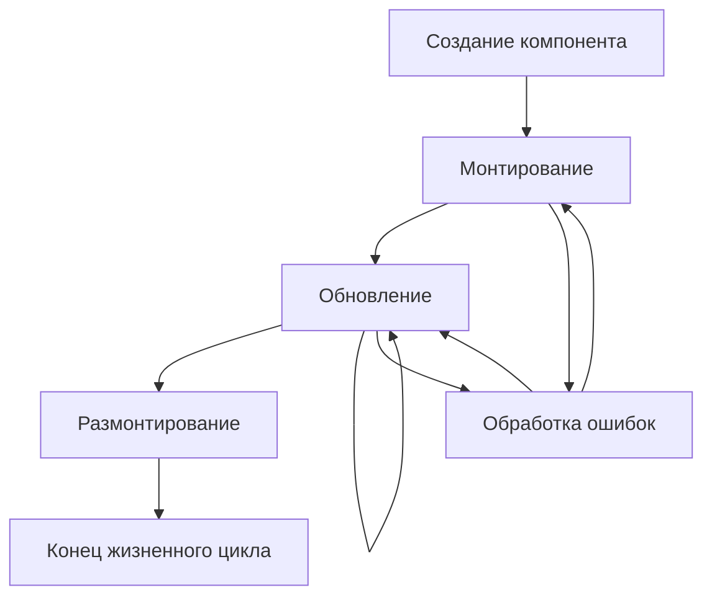

# Фазы жизненного цикла компонента

Жизненный цикл компонента — это последовательность этапов, через которые проходит компонент от своего создания до уничтожения. Понимание этих фаз критически важно для разработчиков, так как позволяет эффективно управлять состоянием, синхронизировать данные, обрабатывать события и оптимизировать производительность приложений.

## Основные фазы жизненного цикла

### 1. Монтирование (Mounting)

Это фаза создания и вставки компонента в DOM. В этот момент компонент инициализируется, получает начальные пропсы и состояние, и рендерится в браузере.

- **Конструктор**: Инициализация состояния и привязка методов
- **getDerivedStateFromProps**: Синхронизация состояния с пропсами
- **render**: Создание виртуального DOM
- **componentDidMount**: Выполнение после монтирования (запросы данных, подписки)

### 2. Обновление (Updating)

Компонент обновляется при изменении пропсов или состояния. В этой фазе происходит перерендеринг компонента с новыми данными.

- **getDerivedStateFromProps**: Синхронизация состояния с новыми пропсами
- **shouldComponentUpdate**: Определение необходимости перерендеринга
- **render**: Создание нового виртуального DOM
- **getSnapshotBeforeUpdate**: Получение информации перед обновлением DOM
- **componentDidUpdate**: Выполнение после обновления (реакция на изменения)

### 3. Размонтирование (Unmounting)

Фаза уничтожения компонента, когда он удаляется из DOM. Важно очистить ресурсы, отписаться от событий и т.д.

- **componentWillUnmount**: Очистка ресурсов, отписка от событий

### 4. Обработка ошибок (Error Handling)

Фаза, в которой обрабатываются ошибки, возникающие в компонентах.

- **componentDidCatch**: Обработка ошибок в дочерних компонентах

## Универсальная диаграмма фаз

## Практическое значение фаз

Каждая фаза жизненного цикла предоставляет разработчику определенные точки входа (методы), в которых можно выполнить необходимую логику. Понимание этих фаз позволяет:

- Оптимизировать производительность приложений
- Правильно управлять состоянием и синхронизировать данные
- Избегать утечек памяти
- Обеспечивать корректное поведение компонентов

## Связанные концепции

- [[Методы-жизненного-цикла-в-React]]
- [[Методы-жизненного-цикла-в-Vue]]
- [[Методы-жизненного-цикла-в-Angular]]
- [[Практическое-применение]]
- [[Компонентная-архитектура]]
- [[Состояние-компонента]]

## Заключение

Фазы жизненного цикла компонента — это фундаментальное понятие в разработке интерфейсов. Независимо от используемого фреймворка (React, Vue, Angular и др.), принципы остаются схожими, хотя и реализуются по-разному. Понимание этих фаз позволяет создавать более предсказуемые и надежные приложения.