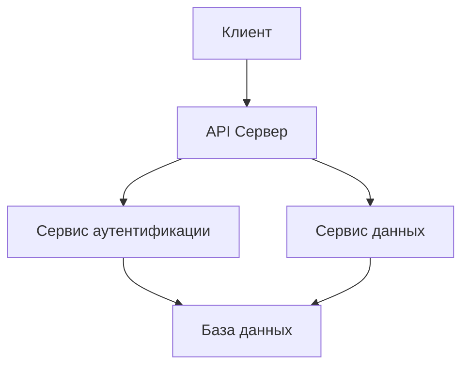

# Документирование-кода

## Обзор

Документирование кода - это процесс создания поясняющих материалов, которые помогают разработчикам понимать, как работает программное обеспечение. Эффективная документация является критическим элементом [[Поддерживаемость]] и знаменует собой важную часть передачи знаний в команде разработчиков.

Хорошая документация включает:
- **Встроенные комментарии** - объяснения внутри кода
- **Внешнюю документацию** - руководства, API документация, архитектурные описания
- **Примеры использования** - демонстрации работы компонентов
- **Объяснение решений** - почему был выбран тот или иной подход

## Типы документации

### Внутренняя документация (в коде)

#### Комментарии в коде

Комментарии должны объяснять "почему", а не "что":

```javascript
// Плохо - комментарий просто повторяет код
// Увеличиваем индекс
index++;

// Хорошо - комментарий объясняет причину
// Пропускаем первый элемент, так как он содержит заголовок
index++;
```

#### Документирование функций и классов

Используйте стандартные форматы документирования:

```javascript
/**
 * Вычисляет общую стоимость заказа с учетом скидок и налогов
 * 
 * @param {Array} items - Массив товаров в заказе
 * @param {number} discount - Процент скидки (0-1)
 * @param {number} taxRate - Ставка налога (0-1)
 * @param {number} shipping - Стоимость доставки
 * @returns {number} Общая стоимость заказа
 * @throws {Error} Если переданы некорректные данные
 * 
 * @example
 * const items = [{ price: 100, quantity: 2 }];
 * const total = calculateOrderTotal(items, 0.1, 0.2, 10);
 * console.log(total); // 208
 */
function calculateOrderTotal(items, discount, taxRate, shipping) {
  // реализация функции
}
```

### Внешняя документация

#### README файлы

Каждый проект должен иметь качественный README:

```markdown
# Название проекта

Краткое описание проекта и его назначения.

## Установка

```bash
npm install
npm run build
```

## Использование

Примеры использования основных функций.

## Архитектура

Объяснение основных компонентов системы.
```

#### API документация

Для библиотек и сервисов создавайте подробную API документацию:

```javascript
/**
 * Сервис аутентификации пользователей
 * 
 * @namespace AuthService
 */
const AuthService = {
  /**
   * Аутентифицирует пользователя по логину и паролю
   * 
   * @method
   * @name AuthService#login
   * @param {string} username - Логин пользователя
   * @param {string} password - Пароль пользователя
   * @returns {Promise<Object>} Объект с токеном и информацией о пользователе
   * @throws {AuthenticationError} Если аутентификация не удалась
   */
  async login(username, password) {
    // реализация
  }
};
```

## Документирование архитектуры

### Диаграммы и схемы

Создавайте диаграммы для объяснения архитектурных решений:



### Архитектурные заметки

Документируйте важные архитектурные решения:

```
## Решение: Использование CQRS
Дата: 2023-10-15
Проблема: Масштабирование чтения и записи в системе управления заказами
Решение: Разделение моделей команд и запросов
Причина: Высокая нагрузка на чтение и запись требует разных оптимизаций
Последствия: Улучшенная производительность, но усложненная архитектура
```

## Стандарты документирования

### Соглашения об именовании

- Используйте единообразные соглашения для комментариев
- Следуйте стандартам для языка программирования (JSDoc, PHPDoc, etc.)
- Документируйте публичные API, но не обязательно внутренние функции

### Стиль написания

- Используйте активный залог
- Будьте краткими, но информативными
- Используйте примеры кода для демонстрации

## Инструменты документирования

### Автоматическая генерация

Используйте инструменты для автоматической генерации документации:

```javascript
// package.json
{
  "scripts": {
    "docs": "jsdoc -c jsdoc.json"
  }
}
```

### Интеграция с Obsidian

Создавайте внутренние ссылки на связанные концепции:

- [[Чистый-код]]
- [[Рефакторинг]]
- [[Управление-зависимостями]]
- [[Поддерживаемость]]

## Практические рекомендации

### Что документировать

1. **Публичные API** - все функции, классы и модули, доступные извне
2. **Сложные алгоритмы** - объяснение логики работы
3. **Архитектурные решения** - причины выбора конкретных подходов
4. **Нестандартные решения** - неочевидные подходы к решению задач
5. **Побочные эффекты** - неожиданные последствия вызова функций

### Что не документировать

1. **Очевидный код** - если код понятен сам по себе
2. **Внутренние вспомогательные функции** - если их поведение очевидно
3. **Временный код** - экспериментальный или временный функционал

## Примеры хорошей документации

### Хорошо документированная функция

```javascript
/**
 * Фильтрует массив пользователей по нескольким критериям
 * 
 * Используется для поиска пользователей в админ-панели. 
 * Функция реализует гибкий поиск с поддержкой частичных совпадений.
 * 
 * @param {Array} users - Массив объектов пользователей
 * @param {Object} filters - Объект с фильтрами
 * @param {string} [filters.name] - Имя пользователя (частичное совпадение)
 * @param {string} [filters.email] - Email пользователя (точное совпадение)
 * @param {string} [filters.role] - Роль пользователя
 * @returns {Array} Отфильтрованный массив пользователей
 * 
 * @example
 * const users = [
 *   { name: 'Иван Иванов', email: 'ivan@example.com', role: 'admin' },
 *   { name: 'Петр Петров', email: 'petr@example.com', role: 'user' }
 * ];
 * 
 * const filtered = filterUsers(users, { name: 'Иван', role: 'admin' });
 * // Возвращает: [{ name: 'Иван Иванов', email: 'ivan@example.com', role: 'admin' }]
 */
function filterUsers(users, filters) {
  return users.filter(user => {
    if (filters.name && !user.name.toLowerCase().includes(filters.name.toLowerCase())) {
      return false;
    }
    if (filters.email && user.email !== filters.email) {
      return false;
    }
    if (filters.role && user.role !== filters.role) {
      return false;
    }
    return true;
  });
}
```

## Обновление документации

- Обновляйте документацию при изменении кода
- Проводите регулярные ревью документации
- Используйте автоматические проверки качества документации

## Ссылки

- [[Чистый-код]]
- [[Рефакторинг]]
- [[Поддерживаемость]]
- [[Управление-зависимостями]]

> [!tip] Совет
> Используйте шаблоны документации для обеспечения единообразия в команде. Это может быть как формат JSDoc, так и внутренние шаблоны в вашей системе документации.

> [!warning] Важно
> Плохо поддерживаемая или устаревшая документация может быть хуже, чем ее отсутствие. Всегда обновляйте документацию при изменении кода.