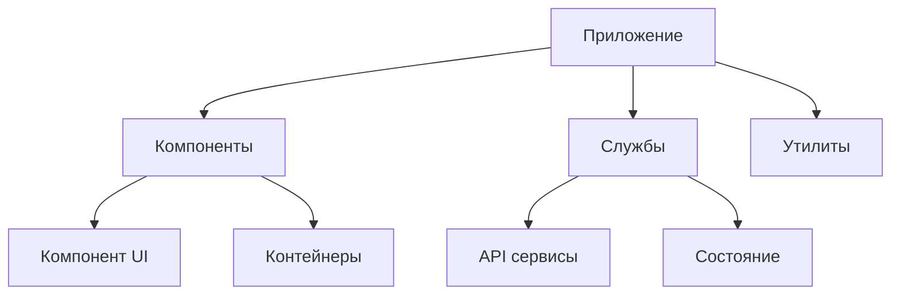

# Управление фронтенд документацией: теория и лучшие практики

## Введение

Управление фронтенд документацией — это критический аспект разработки пользовательских интерфейсов, который обеспечивает согласованность, поддерживаемость и эффективность командной работы. В современном фронтенд-развитии качественная документация не менее важна, чем сам код. Она служит мостом между дизайнерами, разработчиками и тестировщиками, обеспечивая единое понимание архитектуры компонентов, стилей и взаимодействий.

## Основные принципы документирования фронтенда

### 1. Единообразие и стандартизация

Единообразие — основа эффективной документации. Все документы должны следовать единому стилю и формату. Это включает:

- Единый формат описания компонентов
- Согласованные шаблоны для API документации
- Стандартизированные названия и терминология
- Единый стиль оформления

> [!tip] Совет
> Используйте шаблоны документации, которые можно легко применять ко всем новым компонентам и модулям. Это ускоряет процесс документирования и обеспечивает согласованность.

### 2. Актуальность и своевременность

Документация теряет ценность, если она не соответствует текущему состоянию кода. Ключевые принципы:

- Обновление документации при каждом изменении в коде
- Интеграция обновления документации в процесс CI/CD
- Регулярные проверки актуальности документации

### 3. Понятность и доступность

Хорошая документация должна быть понятной не только автору, но и любому члену команды. Это достигается через:

- Ясный язык без излишней технической сложности
- Примеры использования
- Визуальные пояснения (диаграммы, скриншоты)
- Пошаговые инструкции

## Структура фронтенд документации

### Архитектурная документация

Архитектурная документация описывает общую структуру фронтенд-приложения:

- Структура проекта и организация файлов
- Паттерны проектирования, используемые в проекте
- Связи между компонентами и модулями
- Технические решения и обоснования



### Документация компонентов

Каждый компонент должен быть должным образом задокументирован:

- Назначение и функциональность
- Принимаемые пропсы и их типы
- Возможные состояния и варианты использования
- Примеры кода
- Зависимости от других компонентов

Пример структуры документации компонента:

```
## Кнопка (Button)

### Описание
Компонент кнопки используется для выполнения действий пользователем.

### Пропсы
- `type` (string): Тип кнопки (primary, secondary, danger)
- `disabled` (boolean): Заблокирована ли кнопка
- `onClick` (function): Обработчик клика

### Пример использования
```jsx
<Button type="primary" onClick={handleClick}>
  Нажми меня
</Button>
```

### Состояния
- Нормальное
- Наведение
- Нажатие
- Отключено
```

### Документация API и интеграций

Важно документировать:

- Внешние API, с которыми взаимодействует фронтенд
- Форматы запросов и ответов
- Аутентификацию и авторизацию
- Обработку ошибок

## Инструменты для документирования фронтенда

### Автоматизированные инструменты

Современные инструменты позволяют автоматизировать часть процесса документирования:

- **Storybook** — создание живых документаций компонентов
- **JSDoc** — генерация документации из комментариев в коде
- **TypeDoc** — документация для TypeScript проектов
- **Compodoc** — документация для Angular приложений

### Статические генераторы документации

Для более сложных проектов могут использоваться:

- **Docusaurus** — фреймворк для документации от Facebook
- **GitBook** — платформа для создания интерактивной документации
- **VuePress** — генератор документации для Vue.js проектов

## Лучшие практики управления документацией

### 1. Интеграция в процесс разработки

Документация должна быть частью процесса разработки, а не постфактом:

- Требовать документацию при создании новых функций
- Включать проверку документации в код-ревью
- Автоматизировать проверки актуальности

### 2. Версионирование документации

Как и код, документация должна иметь версии:

- Соответствие версиям приложения
- Поддержка старых версий документации
- Понятные пути миграции между версиями

### 3. Поиск и навигация

Хорошо организованная навигация делает документацию полезной:

- Поиск по содержимому
- Категории и теги
- Структура, отражающая архитектуру приложения

## Роль документации в командной разработке

### Ускорение онбординга

Качественная документация значительно ускоряет процесс интеграции новых членов команды:

- Быстрое понимание архитектуры
- Понимание паттернов и практик проекта
- Уменьшение времени на вопросы к опытным разработчикам

### Снижение технического долга

Хорошо документированный код легче поддерживать:

- Понимание намерений оригинальных разработчиков
- Легче вносить изменения без побочных эффектов
- Проще рефакторить и обновлять зависимости

## Стратегии поддержания актуальности

### 1. Автоматизация

Использование инструментов, которые автоматически извлекают информацию из кода:

- Генерация документации из JSDoc комментариев
- Извлечение типов из TypeScript
- Автоматическое создание примеров использования

### 2. Обязательные проверки

Введение процессов, которые требуют обновления документации:

- Проверка документации в пул-реквестах
- Автоматические проверки на соответствие документации коду
- Уведомления о несоответствиях

### 3. Регулярные ревизии

Периодический аудит документации:

- Проверка актуальности устаревших разделов
- Удаление неиспользуемой информации
- Обновление примеров и инструкций

## Измерение эффективности документации

### Метрики использования

Для оценки эффективности документации можно использовать:

- Частоту обращений к различным разделам
- Время, проведенное на страницах документации
- Частоту задаваемых вопросов, на которые есть ответы в документации

### Обратная связь

Сбор обратной связи от пользователей документации:

- Опросы среди команды
- Комментарии и предложения по улучшению
- Отслеживание ошибок и неточностей

## Интеграция с инструментами разработки

### IDE интеграции

Современные IDE могут использовать документацию:

- Подсказки при написании кода
- Автоматическое извлечение документации
- Проверка соответствия документации коду

### Интеграция с системами отслеживания задач

Связь документации с системами управления проектами:

- Ссылки на задачи в документации
- Автоматическое обновление при изменении задач
- Отслеживание прогресса документирования

## Особенности документирования для разных фреймворков

### React

Для React приложений особенно важна документация компонентов:

- Описание пропсов и их типов
- Примеры использования с различными состояниями
- Информация о контекстах и хуках

### Vue.js

В Vue.js проектах документация должна учитывать:

- Структуру компонентов с однофайловыми компонентами
- Свойства, события и слоты
- Интеграцию с Vuex или Pinia

### Angular

Для Angular приложений важно документировать:

- Модули и их зависимости
- Сервисы и их API
- Директивы и пайпы

## Заключение

Управление фронтенд документацией — это инвестиция в будущее проекта. Хорошо организованная и поддерживаемая документация:

- Упрощает разработку и поддержку
- Снижает порог входа для новых разработчиков
- Повышает качество кода
- Упрощает масштабирование проекта

Ключ к успеху — это систематический подход, автоматизация, где это возможно, и интеграция документирования в повседневный процесс разработки. Документация не должна быть бременем, а должна быть помощником, который упрощает жизнь всем участникам проекта.

## Ресурсы для дальнейшего изучения

- [[Документирование компонентов]]
- [[Автоматизированные инструменты документирования]]
- [[Архитектура фронтенд приложений]]
- [[Рефакторинг документации]]
- [[Создание шаблонов документации]]
- [[Интеграция документации в CI/CD]]
- [[Типографика в документации]]
- [[Визуализация архитектуры]]
- [[Техническое письмо для разработчиков]]
- [[Управление знаниями в команде]]
- [[Методологии документирования]]
- [[Практики технического письма]]
- [[Инструменты для документирования]]
- [[Документирование API]]
- [[Создание руководств пользователя]]