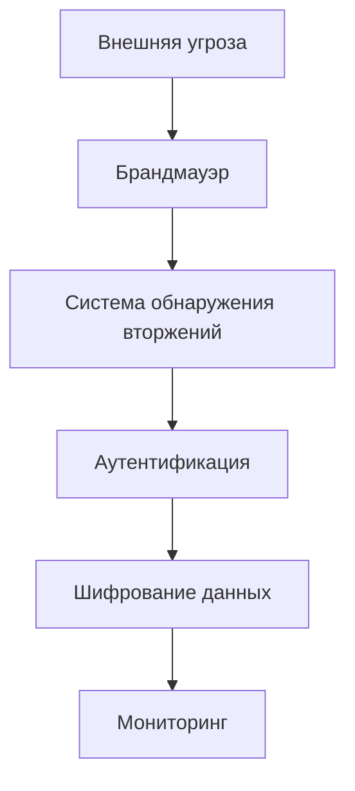

# Архитектурные паттерны безопасности

## Введение в архитектурные паттерны безопасности

Архитектурные паттерны безопасности представляют собой проверенные временем подходы к проектированию систем с учетом безопасности. Эти паттерны помогают разработчикам и архитекторам создавать защищенные приложения, учитывая потенциальные угрозы и уязвимости на этапе проектирования.

> [!info] Определение
> Архитектурный паттерн безопасности - это повторяющееся решение типовой проблемы безопасности в проектировании программных систем.

## Зачем нужны архитектурные паттерны безопасности

Архитектурные паттерны безопасности необходимы для:

- Предотвращения распространенных уязвимостей
- Снижения рисков безопасности
- Упрощения процесса аудита безопасности
- Обеспечения согласованности подходов к защите
- Ускорения разработки безопасных решений

## Принципы безопасного дизайна

При проектировании систем с учетом безопасности важно следовать основным принципам:

- **Минимизация поверхности атаки** - уменьшение количества точек входа и функциональности
- **Прозрачность безопасности** - система должна быть понятной с точки зрения безопасности
- **Сбалансированность** - безопасность не должна препятствовать функциональности
- **Адаптивность** - система должна адаптироваться к новым угрозам

## Паттерн "Защита в глубину" (Defense in Depth)

Паттерн защиты в глубину предполагает использование нескольких уровней защиты для обеспечения безопасности системы. Если одна линия обороны будет преодолена, другие уровни продолжат защищать систему.

### Пример реализации
- Многоуровневая аутентификация
- Сетевые экраны на разных уровнях
- Шифрование на транспортном и прикладном уровне
- Регулярные проверки безопасности

## Паттерн "Безопасность по умолчанию"

Паттерн "Безопасность по умолчанию" предполагает, что система настроена безопасно с самого начала, без необходимости дополнительных действий со стороны пользователя.

### Характеристики:
- Все функции отключены по умолчанию
- Только необходимые разрешения выдаются
- Строгие политики безопасности включены
- Минимальные привилегии для компонентов

## Паттерн "Принцип наименьших привилегий"

Принцип наименьших привилегий требует, чтобы каждый компонент системы имел только минимальные необходимые права для выполнения своих функций.

### Примеры:
- Пользовательские сессии с ограниченными правами
- Микросервисы с ограниченным доступом к ресурсам
- Роли в системе управления доступом

## Паттерн "Отказ по умолчанию"

При невозможности принять решение о безопасности система должна по умолчанию отклонять запрос. Это предотвращает потенциальные атаки через неопределенное поведение.

### Реализация:
- Отказ в доступе при сбоях аутентификации
- Блокировка запросов при сбоях проверки
- Запрет операций при неясной политике

## Паттерн "Изоляция компонентов"

Изоляция компонентов предполагает разделение системы на независимые части с ограниченным взаимодействием для ограничения распространения угроз.

### Техники изоляции:
- Контейнеризация
- Виртуализация
- Микросервисная архитектура
- Разделение по безопасности

## Паттерн "Непрерывная проверка"

Непрерывная проверка подразумевает постоянный мониторинг и проверку безопасности в процессе работы системы, а не только на этапе входа.

### Элементы:
- Постоянная аутентификация
- Проверка целостности
- Мониторинг поведения
- Анализ рисков в реальном времени

## Паттерн "Защита транспортных каналов"

Защита транспортных каналов обеспечивает безопасность данных при передаче между компонентами системы.

### Технологии:
- TLS/SSL для HTTPS
- VPN для удаленного доступа
- IPsec для сетевой безопасности
- Шифрование на уровне приложений

## Паттерн "Контроль доступа"

Контроль доступа управляет тем, кто и к чему имеет доступ в системе. Существует несколько моделей контроля доступа:

- **DAC** (Discretionary Access Control) - дискреционный контроль
- **MAC** (Mandatory Access Control) - обязательный контроль
- **RBAC** (Role-Based Access Control) - ролевой контроль
- **ABAC** (Attribute-Based Access Control) - атрибутивный контроль

## Паттерн "Безопасное хранение данных"

Безопасное хранение данных включает в себя защиту информации на уровне хранилища и управления доступом к ней.

### Методы:
- Шифрование данных при хранении
- Управление ключами
- Резервное копирование с защитой
- Аудит доступа к данным

## Паттерн "Шифрование данных"

Шифрование данных защищает конфиденциальность информации как при передаче, так и при хранении.

### Уровни шифрования:
- На уровне приложений
- На уровне файловой системы
- На уровне баз данных
- На уровне дисков

## Паттерн "Обнаружение вторжений"

Системы обнаружения вторжений (IDS) мониторят систему на предмет подозрительной активности и потенциальных атак.

### Типы IDS:
- **NIDS** - сетевая система обнаружения
- **HIDS** - системная система обнаружения
- **AIDS** - поведенческая система обнаружения

## Паттерн "Реагирование на инциденты"

Эффективное реагирование на инциденты включает в себя подготовленный план действий при обнаружении угроз безопасности.

### Этапы реагирования:
- Обнаружение инцидента
- Оценка воздействия
- Изоляция угрозы
- Устранение угрозы
- Восстановление системы
- Анализ инцидента

## Паттерн "Мониторинг и аудит"

Постоянный мониторинг и аудит обеспечивают видимость всех действий в системе и помогают обнаруживать подозрительную активность.

### Элементы мониторинга:
- Журналы событий
- Алерты безопасности
- Аналитика поведения
- Отчеты по безопасности

## Паттерн "Безопасное обновление"

Безопасное обновление включает в себя проверку целостности и подлинности обновлений перед их установкой.

### Процесс:
- Подпись обновлений
- Проверка хэшей
- Тестирование в изолированной среде
- Постепенное развертывание

## Лучшие практики

- Регулярное обучение команды безопасности
- Использование автоматизированных инструментов
- Проведение пентестов
- Документирование политик безопасности
- Регулярный аудит систем

## Ссылки на другие связанные файлы

- [[Криптография-в-безопасности]]
- [[Аутентификация-и-авторизация]]
- [[Сетевая-безопасность]]
- [[Безопасность-веб-приложений]]
- [[Управление-идентификацией]]
- [[Безопасность-данных]]
- [[Мониторинг-безопасности]]
- [[Пентестинг]]
- [[Управление-уязвимостями]]
- [[Безопасность-микросервисов]]
- [[Безопасность-API]]
- [[Контейнерная-безопасность]]
- [[Cloud-безопасность]]
- [[Безопасность-баз-данных]]
- [[Криптографические-протоколы]]
- [[Безопасность-мобильных-приложений]]
- [[Соответствие-требованиям]]
- [[Безопасность-DevOps]]
- [[Безопасность-блокчейна]]
- [[Этический-хакинг]]