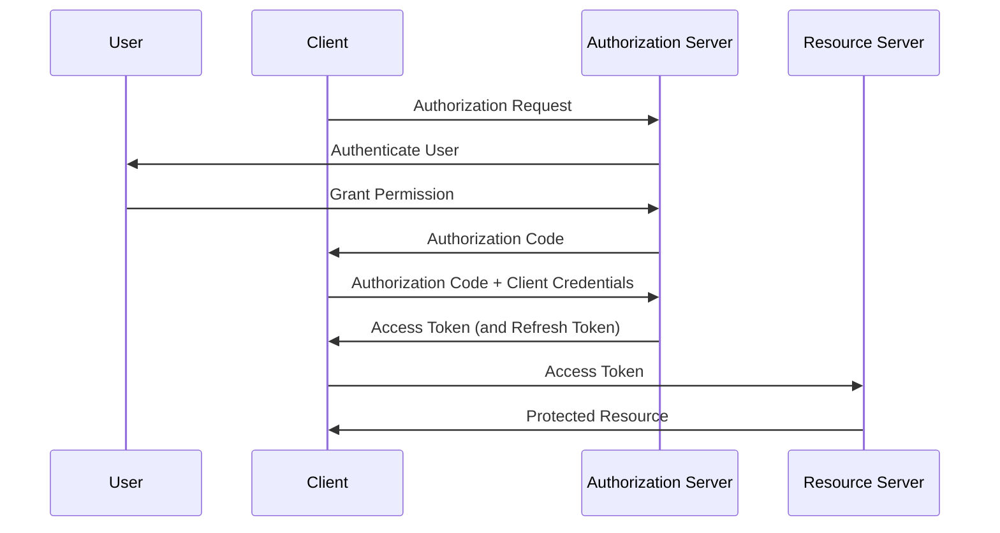

# Потоки авторизации

Потоки авторизации - это стандартизированные процессы, определяющие, как клиентские приложения получают доступ к защищенным ресурсам от имени пользователя или с собственными правами. Эти потоки обеспечивают безопасное делегирование прав доступа без раскрытия учетных данных пользователя.

## Введение

Потоки авторизации являются ключевым компонентом современных систем безопасности, особенно в распределенных и облачных приложениях. Они позволяют приложениям получать доступ к ресурсам без хранения учетных данных пользователя, что снижает риски безопасности.

## Стандарты и протоколы

### OAuth 2.0

Основной стандарт для делегирования авторизации:

- RFC 6749 - основная спецификация
- RFC 8628 - Device Flow
- RFC 7636 - PKCE (Proof Key for Code Exchange)
- RFC 6750 - токены Bearer

### OAuth 2.1

Обновленная версия OAuth 2.0:

- Упрощение спецификации
- Удаление устаревших функций
- Обязательное использование PKCE
- Улучшенная безопасность

### OpenID Connect

Расширение OAuth 2.0 для аутентификации:

- Идентификация пользователя
- Информация о профиле пользователя
- Совместимость с OAuth 2.0
- [[Управление-доступом]] в распределенных системах

## Основные компоненты

### Участники потока

- **Resource Owner** - пользователь, владеющий ресурсами
- **Client** - приложение, запрашивающее доступ
- **Authorization Server** - сервер, выдающий токены
- **Resource Server** - сервер, защищающий ресурсы

### Типы токенов

#### Access Token

- Предоставляет доступ к ресурсам
- Временные права
- Обычно в формате JWT
- [[Управление-ключами]] для токенов

#### Refresh Token

- Обновление access token
- Долгосрочный токен
- Требует безопасного хранения
- [[Зашифрованное-хранилище]] для refresh токенов

#### ID Token

- Информация о пользователе (OpenID Connect)
- Содержит утверждения о пользователе
- Подписан JWT токен
- [[Клиентское-шифрование]] для защиты токенов

## Типы потоков авторизации

### Authorization Code Flow

Наиболее безопасный поток для веб-приложений:



**Преимущества:**
- Безопасная передача токенов
- Поддержка PKCE
- Подходит для серверных приложений

**Использование:**
- Веб-приложения с серверной частью
- Приложения с возможностью хранения client_secret

### Implicit Flow

Быстрый, но менее безопасный поток:

- Токены передаются сразу
- Не требует серверной части
- Устарел в OAuth 2.1
- Заменен Authorization Code с PKCE

### Resource Owner Password Credentials Flow

Прямая аутентификация пользователя:

```javascript
// Пример запроса
const response = await fetch('/token', {
  method: 'POST',
  headers: {
    'Content-Type': 'application/x-www-form-urlencoded',
    'Authorization': 'Basic ' + btoa(clientId + ':' + clientSecret)
  },
  body: 'grant_type=password&username=user&password=pass&scope=read'
});
```

**Использование:**
- Только для доверенных приложений
- Владелец контролирует клиента
- Не рекомендуется для сторонних приложений

### Client Credentials Flow

Аутентификация приложения как субъекта:

```javascript
// Пример запроса
const response = await fetch('/token', {
  method: 'POST',
  headers: {
    'Content-Type': 'application/x-www-form-urlencoded',
    'Authorization': 'Basic ' + btoa(clientId + ':' + clientSecret)
  },
  body: 'grant_type=client_credentials&scope=read'
});
```

**Использование:**
- Межсерверное взаимодействие
- Приложения как субъекты
- Системы без пользовательского контекста

### Device Flow

Для устройств с ограниченным интерфейсом:

```javascript
// Этап 1: запрос устройства
const deviceResponse = await fetch('/device_authorization', {
  method: 'POST',
  headers: { 'Content-Type': 'application/x-www-form-urlencoded' },
  body: `client_id=${clientId}&scope=read`
});

const { device_code, user_code, verification_uri } = await deviceResponse.json();

// Отображение инструкций пользователю
console.log(`Visit ${verification_uri} and enter code: ${user_code}`);

// Этап 2: опрос токена
let token;
while (!token) {
  await new Promise(resolve => setTimeout(resolve, 5000));
  const tokenResponse = await fetch('/token', {
    method: 'POST',
    headers: { 'Content-Type': 'application/x-www-form-urlencoded' },
    body: `grant_type=urn:ietf:params:oauth:grant-type:device_code&device_code=${device_code}&client_id=${clientId}`
  });
  
  const tokenData = await tokenResponse.json();
  if (tokenData.access_token) {
    token = tokenData;
  } else if (tokenData.error === 'authorization_pending') {
    // Продолжить опрос
  } else if (tokenData.error === 'slow_down') {
    // Увеличить задержку
  }
}
```

## Защита потоков

### PKCE (Proof Key for Code Exchange)

Защита от атак перехвата кода:

```javascript
// Генерация кода
const codeVerifier = generateRandomString(128);
const codeChallenge = base64URLEncode(sha256(codeVerifier));

// Авторизация с PKCE
const authUrl = `https://auth-server.com/authorize?` +
  `client_id=${clientId}&` +
  `redirect_uri=${redirectUri}&` +
  `response_type=code&` +
  `code_challenge=${codeChallenge}&` +
  `code_challenge_method=S256`;

// При обмене кода на токен
const response = await fetch('/token', {
  method: 'POST',
  headers: { 'Content-Type': 'application/x-www-form-urlencoded' },
  body: `grant_type=authorization_code&` +
        `code=${authorizationCode}&` +
        `redirect_uri=${redirectUri}&` +
        `client_id=${clientId}&` +
        `code_verifier=${codeVerifier}`
});
```

### State Parameter

Защита от CSRF атак:

```javascript
// Генерация state параметра
const state = generateRandomString(32);
sessionStorage.setItem('oauth_state', state);

// Включение в запрос авторизации
const authUrl = `https://auth-server.com/authorize?` +
  `client_id=${clientId}&` +
  `redirect_uri=${redirectUri}&` +
  `response_type=code&` +
  `state=${state}`;

// Проверка state при возврате
const urlParams = new URLSearchParams(window.location.search);
const returnedState = urlParams.get('state');

if (returnedState !== sessionStorage.getItem('oauth_state')) {
  throw new Error('Invalid state parameter');
}
```

## Практические примеры

### Веб-приложение с Node.js

```javascript
const express = require('express');
const session = require('express-session');
const crypto = require('crypto');
const axios = require('axios');

const app = express();

app.use(session({
  secret: 'your-session-secret',
  resave: false,
  saveUninitialized: true
}));

// Маршрут начала авторизации
app.get('/login', (req, res) => {
  const state = crypto.randomBytes(32).toString('hex');
  req.session.oauthState = state;
  
  const authUrl = `https://auth-server.com/authorize?` +
    `client_id=${process.env.CLIENT_ID}&` +
    `redirect_uri=${process.env.REDIRECT_URI}&` +
    `response_type=code&` +
    `scope=profile email&` +
    `state=${state}`;
  
  res.redirect(authUrl);
});

// Маршрут обратного вызова
app.get('/callback', async (req, res) => {
  const { code, state } = req.query;
  
  // Проверка state
  if (state !== req.session.oauthState) {
    return res.status(400).send('Invalid state');
  }
  
  try {
    // Обмен кода на токен
    const tokenResponse = await axios.post('https://auth-server.com/token', {
      grant_type: 'authorization_code',
      client_id: process.env.CLIENT_ID,
      client_secret: process.env.CLIENT_SECRET,
      redirect_uri: process.env.REDIRECT_URI,
      code: code
    });
    
    req.session.accessToken = tokenResponse.data.access_token;
    req.session.refreshToken = tokenResponse.data.refresh_token;
    
    res.redirect('/dashboard');
  } catch (error) {
    res.status(500).send('Authentication failed');
  }
});

// Защищенный маршрут
app.get('/dashboard', async (req, res) => {
  if (!req.session.accessToken) {
    return res.redirect('/login');
  }
  
  try {
    const userResponse = await axios.get('https://api-server.com/user', {
      headers: {
        'Authorization': `Bearer ${req.session.accessToken}`
      }
    });
    
    res.json(userResponse.data);
  } catch (error) {
    if (error.response.status === 401) {
      // Попытка обновить токен
      try {
        const refreshResponse = await axios.post('https://auth-server.com/token', {
          grant_type: 'refresh_token',
          client_id: process.env.CLIENT_ID,
          client_secret: process.env.CLIENT_SECRET,
          refresh_token: req.session.refreshToken
        });
        
        req.session.accessToken = refreshResponse.data.access_token;
        // Повторить запрос
      } catch (refreshError) {
        return res.redirect('/login');
      }
    }
  }
});
```

### SPA приложение с PKCE

```javascript
class OAuthClient {
  constructor(config) {
    this.config = config;
  }
  
  async initiateAuth() {
    // Генерация PKCE параметров
    const codeVerifier = this.generateCodeVerifier();
    const codeChallenge = await this.generateCodeChallenge(codeVerifier);
    
    // Сохранение verifier для последующего использования
    sessionStorage.setItem('pkce_verifier', codeVerifier);
    
    // Генерация state для защиты от CSRF
    const state = this.generateRandomString(32);
    sessionStorage.setItem('oauth_state', state);
    
    // Формирование URL авторизации
    const authUrl = new URL(this.config.authUrl);
    authUrl.searchParams.set('client_id', this.config.clientId);
    authUrl.searchParams.set('redirect_uri', this.config.redirectUri);
    authUrl.searchParams.set('response_type', 'code');
    authUrl.searchParams.set('scope', this.config.scope);
    authUrl.searchParams.set('state', state);
    authUrl.searchParams.set('code_challenge', codeChallenge);
    authUrl.searchParams.set('code_challenge_method', 'S256');
    
    // Перенаправление на страницу авторизации
    window.location.href = authUrl.toString();
  }
  
  async handleCallback() {
    const urlParams = new URLSearchParams(window.location.search);
    const code = urlParams.get('code');
    const state = urlParams.get('state');
    
    // Проверка state
    const storedState = sessionStorage.getItem('oauth_state');
    if (state !== storedState) {
      throw new Error('Invalid state parameter');
    }
    
    // Получение verifier
    const codeVerifier = sessionStorage.getItem('pkce_verifier');
    
    // Обмен кода на токен
    const tokenResponse = await fetch(this.config.tokenUrl, {
      method: 'POST',
      headers: {
        'Content-Type': 'application/x-www-form-urlencoded'
      },
      body: new URLSearchParams({
        grant_type: 'authorization_code',
        client_id: this.config.clientId,
        code: code,
        redirect_uri: this.config.redirectUri,
        code_verifier: codeVerifier
      })
    });
    
    if (!tokenResponse.ok) {
      throw new Error('Token exchange failed');
    }
    
    const tokens = await tokenResponse.json();
    
    // Сохранение токенов
    this.saveTokens(tokens);
    
    // Очистка временных данных
    sessionStorage.removeItem('pkce_verifier');
    sessionStorage.removeItem('oauth_state');
    
    return tokens;
  }
  
  generateCodeVerifier() {
    return this.generateRandomString(128);
  }
  
  async generateCodeChallenge(verifier) {
    const encoder = new TextEncoder();
    const data = encoder.encode(verifier);
    const digest = await crypto.subtle.digest('SHA-256', data);
    return this.base64URLEncode(digest);
  }
  
  generateRandomString(length) {
    const array = new Uint8Array(length);
    crypto.getRandomValues(array);
    return Array.from(array, byte => byte.toString(16).padStart(2, '0')).join('');
  }
  
  base64URLEncode(buffer) {
    return btoa(String.fromCharCode(...new Uint8Array(buffer)))
      .replace(/\+/g, '-')
      .replace(/\//g, '_')
      .replace(/=/g, '');
  }
  
  saveTokens(tokens) {
    localStorage.setItem('access_token', tokens.access_token);
    localStorage.setItem('refresh_token', tokens.refresh_token);
    localStorage.setItem('token_expires_at', 
      (Date.now() + (tokens.expires_in * 1000)).toString());
  }
}
```

## Безопасность потоков

### Защита от атак

#### CSRF (Cross-Site Request Forgery)

- Использование state параметра
- Проверка referer заголовка
- CSRF токены
- [[Сигнализация-безопасности]] для аномальных запросов

#### Replay Attacks

- Использование одноразовых токенов
- Временные ограничения
- Проверка уникальности
- [[Анализ-логов]] для выявления аномалий

#### Token Theft

- HTTPS для всех запросов
- Ограничение времени жизни токенов
- Мониторинг использования
- [[Зашифрованное-хранилище]] для токенов

### Лучшие практики

#### Время жизни токенов

- Короткое время жизни access токенов (15-60 минут)
- Долгое время жизни refresh токенов (дни/недели)
- Возможность отзыва токенов
- [[Управление-ключами]] для токенов

#### Обработка ошибок

- Безопасные сообщения об ошибках
- Журналирование ошибок
- Защита от информационных утечек
- [[Анализ-логов]] для выявления атак

## Интеграция с системами

### [[Методы-контроля-доступа]]

- Использование токенов для принятия решений
- Интеграция с RBAC/ABAC системами
- Атрибуты из токенов для ABAC
- [[Атрибутное-управление-доступом]]

### [[Сигнализация-безопасности]]

- Мониторинг аномального использования токенов
- Оповещения о подозрительных попытках доступа
- Интеграция с SIEM системами
- [[Инструменты-мониторинга-безопасности]]

## Современные тенденции

### Zero Trust

- Проверка на каждом запросе
- Минимальные привилегии
- Постоянное подтверждение подлинности
- [[Методы-контроля-доступа]] в Zero Trust архитектуре

### Continuous Authorization

- Динамическая оценка доступа
- Учет контекста в реальном времени
- Обновление решений по мере изменения условий
- [[Потоки-авторизации]] с учетом рисков

### FAPI (Financial-grade API)

- Усиленные требования безопасности
- Обязательное использование PKCE
- Требования к TLS
- [[Управление-доступом]] в финансовых приложениях

> [!tip] Совет
> Всегда используйте Authorization Code Flow с PKCE для клиентских приложений, даже если они доверенные.

> [!warning] Важно
> Никогда не передавайте refresh токены через URL параметры или в открытом виде.

## Заключение

Потоки авторизации обеспечивают безопасное делегирование прав доступа в распределенных системах. Правильная реализация этих потоков критически важна для безопасности приложений и должна учитывать как стандартные угрозы, так и специфические требования к безопасности.