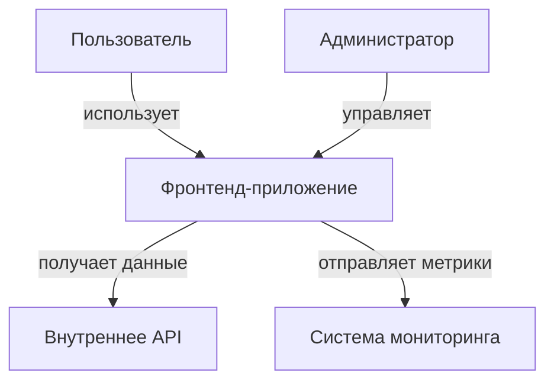

# Диаграммы архитектуры фронтенд-приложений

## Обзор

Диаграммы архитектуры являются важным инструментом для визуализации структуры фронтенд-приложений. Они помогают командам понимать связи между компонентами, архитектурные решения и общую организацию системы. В условиях российской разработки 2025 года диаграммы становятся особенно важными для обеспечения понимания сложных систем и передачи знаний внутри команд.

## Модель C4 для фронтенд-архитектуры

Модель C4 (Context, Containers, Components, Code) предоставляет иерархический подход к документированию архитектуры:

### 1. Контекстная диаграмма (Level 1)
Показывает систему в широком контексте, включая пользователей и внешние системы.

### 2. Контейнерная диаграмма (Level 2)
Показывает основные технические компоненты приложения:

- SPA приложение
- Статический сервер
- Библиотеки компонентов
- Системы сборки

### 3. Компонентная диаграмма (Level 3)
Детализирует внутреннюю структуру контейнеров, показывая отдельные модули и их взаимодействие.

### 4. Кодовая диаграмма (Level 4)
Детализирует реализацию отдельных компонентов (обычно генерируется автоматически).

## Типы диаграмм для фронтенд-архитектуры

### 1. Диаграммы потоков данных
Показывают, как данные перемещаются между компонентами приложения:

### 2. Диаграммы зависимостей
Отображают зависимости между модулями и библиотеками.

### 3. Диаграммы состояний
Показывают жизненный цикл компонентов и переходы между состояниями.

### 4. Диаграммы развертывания
Описывают, как фронтенд-приложение развертывается и взаимодействует с инфраструктурой.

## Инструменты для создания диаграмм

### 1. Mermaid
- Простой синтаксис
- Встроенная поддержка в Obsidian
- Отлично подходит для документации

### 2. PlantUML
- Более мощный, но сложный синтаксис
- Поддержка различных типов диаграмм
- Интеграция с системами CI/CD

### 3. Draw.io (diagrams.net)
- Визуальный редактор
- Подходит для сложных диаграмм
- Поддержка экспорта в различные форматы

### 4. Miro, Figma
- Онлайн-инструменты для совместной работы
- Подходят для мозгового штурма архитектуры
- Возможность совместного редактирования

## Лучшие практики создания диаграмм

- Используйте единый стиль оформления
- Поддерживайте диаграммы в актуальном состоянии
- Добавляйте легенды и пояснения
- Связывайте диаграммы с [[Архитектурная-документация]]
- Используйте русскоязычные обозначения в соответствии с российскими реалиями

## Диаграммы для разных аудиторий

### Техническая команда
- Подробные диаграммы компонентов
- Диаграммы зависимостей
- Диаграммы архитектурных слоев

### Руководство проекта
- Контекстные диаграммы
- Диаграммы ценности для бизнеса
- Диаграммы рисков и зависимостей

### Новые разработчики
- Упрощенные диаграммы потоков
- Диаграммы структуры кода
- Диаграммы жизненного цикла приложения

## Автоматизация диаграмм

В 2025 году особенно актуальна автоматизация создания диаграмм:

- Генерация диаграмм зависимостей из package.json
- Автоматическое обновление диаграмм при изменениях в коде
- Интеграция с системами CI/CD для проверки актуальности

## Российские особенности

В условиях 2025 года в России:
- Увеличилось использование отечественных инструментов
- Усилены требования к защите информации
- Повышен интерес к локализованным решениям
- Актуализированы стандарты документирования

При создании диаграмм важно:
- Использовать русскоязычные обозначения
- Учитывать требования отечественных стандартов
- Обеспечивать совместимость с отечественными инструментами

## Связь с другими аспектами

Диаграммы тесно связаны с:
- [[ADR]]: Визуализируют принятые решения
- [[Спецификации]]: Подтверждают архитектурные спецификации
- [[Поддержка-документации]]: Требуют поддержания актуальности
- [[Архитектурные паттерны]]: Иллюстрируют применение паттернов

## Ключевые выводы

- Диаграммы делают архитектуру понятной для всех участников
- Используйте модель C4 для структурированного подхода
- Поддерживайте диаграммы в актуальном состоянии
- Учитывайте специфику российского рынка
- Автоматизируйте где возможно