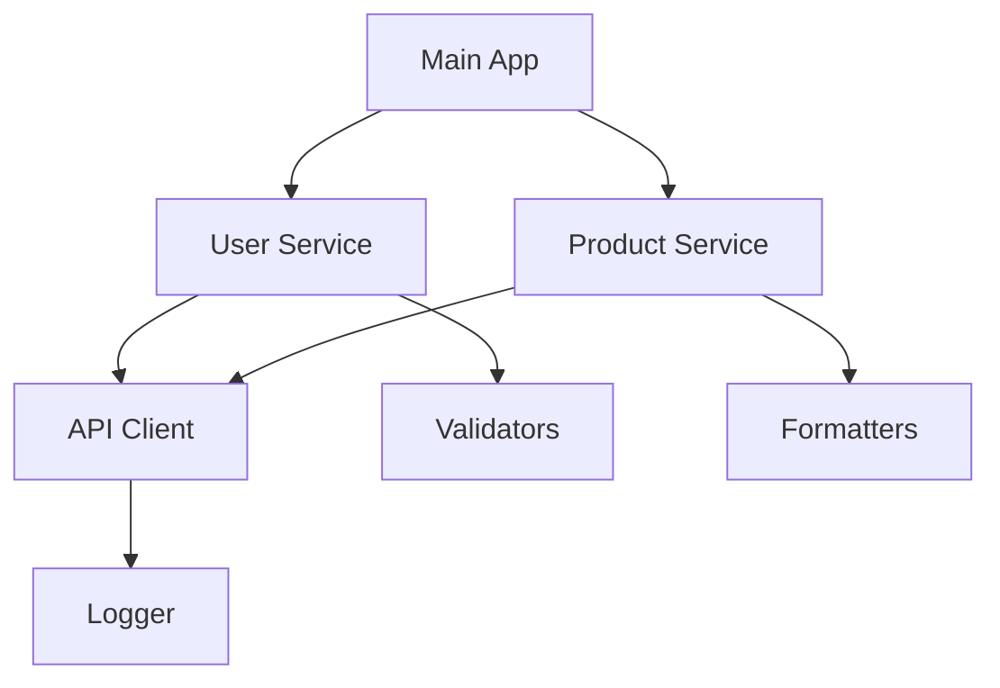

# Зависимости-модулей

## Введение

Зависимости модулей - это отношения между модулями, при которых один модуль требует функциональности другого модуля для своей работы. Правильное управление зависимостями является критически важным аспектом модульной архитектуры фронтенд-приложений, влияющим на производительность, поддерживаемость и масштабируемость кодовой базы.

## Типы зависимостей модулей

### 1. Прямые зависимости

Прямые зависимости - это модули, которые явно импортируются в текущий модуль:

```javascript
// user-service.js
import { apiClient } from './api-client.js';        // Прямая зависимость
import { validateUser } from './validators.js';     // Прямая зависимость
import { logger } from '../utils/logger.js';        // Прямая зависимость

export const getUser = async (id) => {
  try {
    const userData = await apiClient.get(`/users/${id}`);
    if (validateUser(userData)) {
      logger.info(`User ${id} retrieved successfully`);
      return userData;
    }
  } catch (error) {
    logger.error(`Failed to retrieve user ${id}:`, error);
    throw error;
  }
};
```

### 2. Косвенные зависимости

Косвенные зависимости - это зависимости зависимостей, которые автоматически становятся частью графа зависимостей:

```javascript
// main.js
import { userService } from './services/user-service.js'; // Косвенные зависимости: api-client.js, validators.js, logger.js

// Когда мы импортируем userService, мы также неявно зависим от всех его зависимостей
```

### 3. Циклические зависимости

Циклические зависимости возникают, когда два или более модуля зависят друг от друга:

```javascript
// user.js - ПЛОХО: циклическая зависимость
import { orderService } from './order.js';

export const getUserOrders = (userId) => {
  return orderService.getOrdersByUser(userId);
};

// order.js - ПЛОХО: циклическая зависимость
import { userService } from './user.js';

export const getOrdersByUser = (userId) => {
  const user = userService.getUser(userId);
  return user.orders || [];
};
```

**Решение проблемы циклических зависимостей:**

```javascript
// common.js - Создаем общий модуль для разрешения цикла
export const getUserOrders = (user, orders) => {
  return orders.filter(order => order.userId === user.id);
};

// user.js
import { getUserOrders } from './common.js';

// order.js
import { getUserOrders } from './common.js';
```

## Управление зависимостями

### 1. Граф зависимостей

Граф зависимостей - это визуальное или структурное представление всех зависимостей в приложении:



### 2. Сканирование зависимостей

Для анализа зависимостей можно использовать инструменты:

```javascript
// dependency-analyzer.js
import fs from 'fs';
import path from 'path';

export const analyzeDependencies = (filePath) => {
  const content = fs.readFileSync(filePath, 'utf8');
  const importRegex = /import\s+[\s\S]*?from\s+['"]([^'"]+)['"]/g;
  const dynamicImportRegex = /import\s*\(\s*['"]([^'"]+)['"]\s*\)/g;
  
  const staticImports = [];
  const dynamicImports = [];
  
  let match;
  while ((match = importRegex.exec(content)) !== null) {
    staticImports.push(match[1]);
  }
  
  while ((match = dynamicImportRegex.exec(content)) !== null) {
    dynamicImports.push(match[1]);
  }
  
  return { staticImports, dynamicImports };
};
```

### 3. Дерево зависимостей

Для отображения полного дерева зависимостей:

```javascript
// dependency-tree.js
export const buildDependencyTree = (entryPoint, modulesMap) => {
  const visited = new Set();
  
  const traverse = (modulePath) => {
    if (visited.has(modulePath)) {
      return { path: modulePath, dependencies: [], circular: true };
    }
    
    visited.add(modulePath);
    
    const module = modulesMap.get(modulePath);
    if (!module) {
      return { path: modulePath, dependencies: [] };
    }
    
    const dependencies = module.imports.map(dep => {
      const resolvedPath = resolveModulePath(dep, path.dirname(modulePath));
      return traverse(resolvedPath);
    });
    
    return { path: modulePath, dependencies };
  };
  
  return traverse(entryPoint);
};
```

## Лучшие практики управления зависимостями

### 1. Минимизация зависимостей

Старайтесь минимизировать количество зависимостей в каждом модуле:

```javascript
// ПЛОХО: слишком много зависимостей
import { 
  userService, 
  productService, 
  orderService, 
  notificationService, 
  analyticsService,
  authService,
  cacheService
} from '../services/index.js';

// ЛУЧШЕ: минимальные зависимости
import { userService } from '../services/user-service.js';
import { validateUser } from '../validators/user-validator.js';
```

### 2. Использование агрегирующих модулей

Создавайте агрегирующие модули для удобства импорта:

```javascript
// services/index.js
export { default as userService } from './user-service.js';
export { default as productService } from './product-service.js';
export { default as orderService } from './order-service.js';

// В других модулях
import { userService, productService } from './services/index.js';
```

### 3. Контроль циклических зависимостей

Используйте инструменты и практики для предотвращения циклических зависимостей:

```javascript
// tools/circular-dependency-checker.js
export const checkCircularDependencies = (dependencyGraph) => {
  const visited = new Set();
  const recursionStack = new Set();
  
  const hasCycle = (node, path = []) => {
    if (recursionStack.has(node)) {
      return [...path, node]; // Найден цикл
    }
    
    if (visited.has(node)) {
      return false;
    }
    
    visited.add(node);
    recursionStack.add(node);
    
    for (const dependency of dependencyGraph[node] || []) {
      const cycle = hasCycle(dependency, [...path, node]);
      if (cycle) {
        return cycle;
      }
    }
    
    recursionStack.delete(node);
    return false;
  };
  
  for (const node in dependencyGraph) {
    const cycle = hasCycle(node);
    if (cycle) {
      console.warn(`Обнаружена циклическая зависимость: ${cycle.join(' -> ')}`);
      return true;
    }
  }
  
  return false;
};
```

## Инструменты анализа зависимостей

### 1. Webpack Bundle Analyzer

Для анализа зависимостей в сборке Webpack:

```bash
npm install --save-dev webpack-bundle-analyzer
```

```javascript
// webpack.config.js
import BundleAnalyzerPlugin from 'webpack-bundle-analyzer';

export default {
  // ... другая конфигурация
  plugins: [
    new BundleAnalyzerPlugin({
      analyzerMode: 'static',
      openAnalyzer: false,
    })
  ]
};
```

### 2. Depcheck

Инструмент для поиска неиспользуемых зависимостей:

```bash
npm install -g depcheck
depcheck /path/to/your/project
```

### 3. Madge

Инструмент для визуализации и анализа графа зависимостей:

```bash
npm install -g madge
madge --circular /path/to/your/src
```

## Управление зависимостями в российских реалиях 2025 года

### 1. Локальные репозитории и внутренние пакеты

В российской IT-среде часто используются внутренние NPM-репозитории:

```json
// .npmrc
@mycompany:registry=https://npm.mycompany.ru
//npm.mycompany.ru/:_authToken=${NPM_TOKEN}
registry=https://registry.npmjs.org/
```

### 2. Ограничения доступа к внешним ресурсам

С учетом возможных ограничений доступа к внешним ресурсам:

- Использование зеркал npm-репозиториев
- Хранение критических зависимостей в локальных репозиториях
- Проверка доступности внешних зависимостей

### 3. Корпоративные стандарты

Крупные российские компании часто устанавливают стандарты:

- Одобрение внешних зависимостей через архитектурный комитет
- Использование только проверенных и безопасных пакетов
- Регулярный аудит зависимостей на уязвимости

## Примеры анализа зависимостей

### 1. Простой анализ зависимостей

```javascript
// src/analyzer/simple-dependency-analyzer.js
import { readFileSync } from 'fs';
import { resolve, dirname } from 'path';

export class SimpleDependencyAnalyzer {
  constructor(rootDir) {
    this.rootDir = rootDir;
    this.dependencies = new Map();
  }
  
  analyzeFile(filePath) {
    const content = readFileSync(filePath, 'utf8');
    const importRegex = /from\s+['"]([^'"]+)['"]/g;
    const matches = [...content.matchAll(importRegex)];
    const imports = matches.map(match => match[1]);
    
    // Преобразование относительных импортов в абсолютные
    const resolvedImports = imports.map(imp => {
      if (imp.startsWith('./') || imp.startsWith('../')) {
        return resolve(dirname(filePath), imp);
      }
      return imp; // Для внешних зависимостей
    });
    
    this.dependencies.set(filePath, resolvedImports);
    return resolvedImports;
  }
  
  getDependencyGraph() {
    return Object.fromEntries(this.dependencies);
  }
  
  findUnusedDependencies() {
    // Логика поиска неиспользуемых зависимостей
    const allImports = new Set();
    for (const imports of this.dependencies.values()) {
      imports.forEach(imp => allImports.add(imp));
    }
    
    // Сравнение с package.json
    return this.findInPackageJsonButNotUsed(allImports);
  }
}
```

### 2. Tree-shaking и оптимизация

```javascript
// utils/tree-shaking-demo.js
// Пример показывает, как зависимости влияют на tree-shaking

// library.js - Библиотека с множественными экспортами
export const utils = {
  format: (str) => str.trim(),
  validate: (val) => val !== null && val !== undefined,
  transform: (data) => Array.isArray(data) ? data.map(item => ({ ...item })) : data
};

export const api = {
  get: (url) => fetch(url),
  post: (url, data) => fetch(url, { method: 'POST', body: data })
};

// Если импортировать только часть функциональности:
import { utils } from './library.js'; // В идеале, только utils должен попасть в бандл
```

## Заключение

Управление зависимостями модулей - ключевой аспект построения масштабируемых и поддерживаемых фронтенд-приложений. Правильная организация зависимостей позволяет:

- Уменьшить размер бандла за счет tree-shaking
- Повысить производительность приложения
- Упростить сопровождение и тестирование кода
- Избежать проблем с циклическими зависимостями
- Обеспечить лучшую архитектурную ясность

В условиях российской IT-среды 2025 года особое внимание уделяется безопасности, стабильности и совместимости с корпоративной инфраструктурой, что делает управление зависимостями еще более критичным аспектом разработки.

[[ES6-модули]] [[Модульные-паттерны]] [[Ленивая-загрузка]] [[Code-splitting]] [[Модульная-архитектура-фронтенд-приложений]]